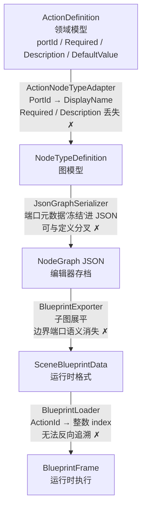
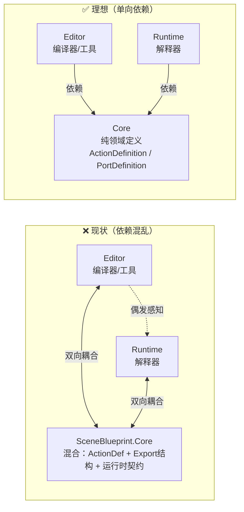
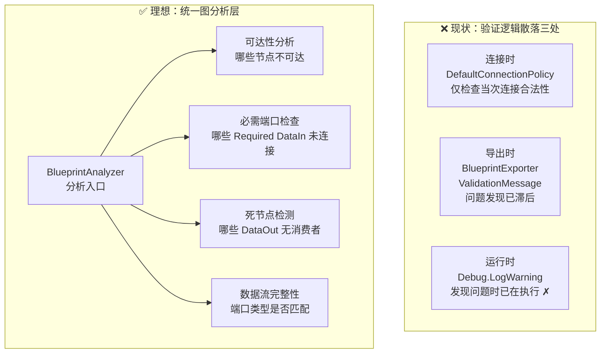
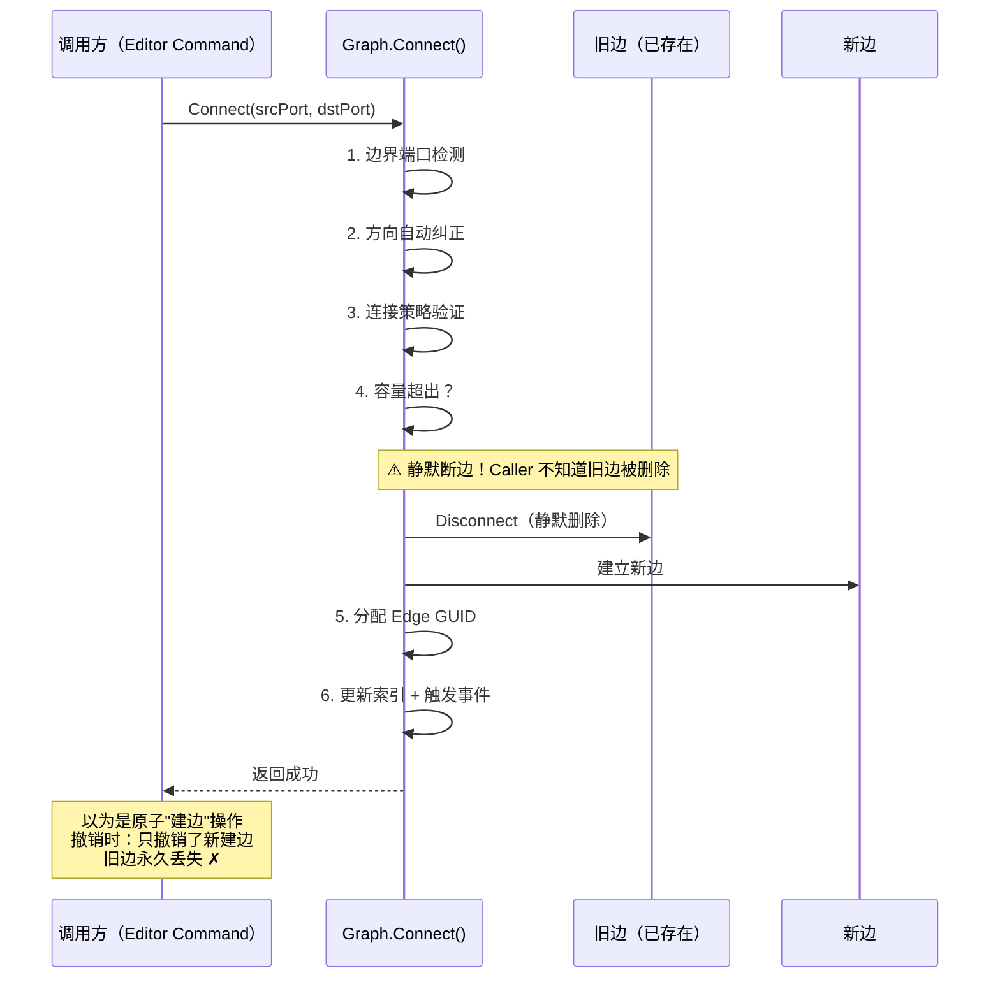
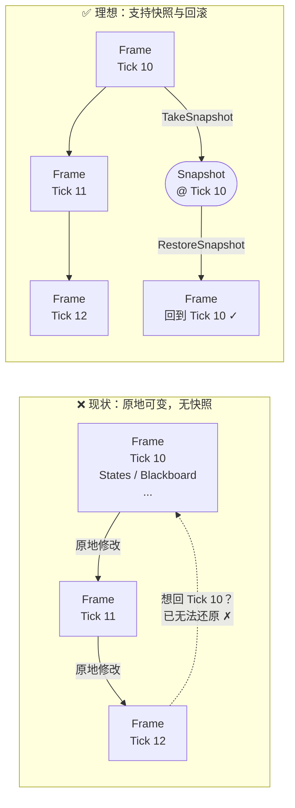
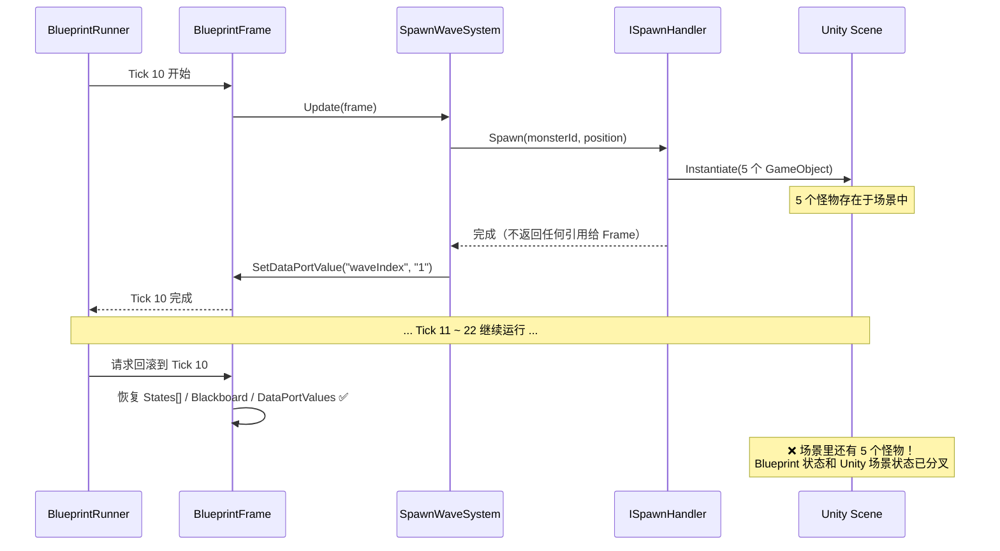

# SceneBlueprint 框架优化分析与改进路线

> doc_status: active  
> last_reviewed: 2026-02-21  
> 本文档整合了 2026-02-20 针对 NodeGraph + SceneBlueprint 框架的系统性分析讨论，  
> 涵盖"近期打补丁修复的根因"、"顶层架构缺陷"、"中层模块设计问题"和"改进优先级路线"。

---

## 一、近期补丁修复汇总（根因回溯）

以下修复均在 2026-02-20 落地，但它们本质上都是对更深层设计问题的"临时补丁"。

| 编号 | 修复文件 | 修复内容 | 根本原因 |
|------|----------|----------|----------|
| DI-3 | `DataTypeRegistry.IsCompatible` | 空串=Any 修复 | Any 类型在两层有不同表示（`""`vs`"any"`） |
| DI-4 | `TypeCompatibilityRegistry.IsCompatible` | 空串=Any 修复 | 同上 |
| DI-5 | `ActionNodeTypeAdapter.ConvertPort` | Data 端口空 DataType 不再覆盖为 `exec` | Adapter 层混淆了"无类型(Any)"和"控制流(exec)" |
| DI-6 | `DefaultConnectionPolicy` | Data 端口 `exec` DataType 视为 Any | 旧 JSON 里存了错误的端口 DataType |
| DI-7 | `SceneBlueprintConnectionPolicy` | 同上 | 同上 |
| DI-8 | `BlueprintExporter.IsDataEdge` | 改用源端口 Kind 判断，不依赖 EdgeData | EdgeData 从未被序列化/反序列化，永远为 null |
| DI-9 | `预设怪物测试蓝图.json` | waveIndex→compareValue 从 Transitions 移到 DataConnections | IsDataEdge bug 导致所有边都落入 Transitions |

**共性根因**：端口元数据存在 JSON 里但可能过期（DI-6/7/8/9）+ 两套类型系统未统一（DI-3/4/5）。

---

## 二、顶层架构缺陷（T 系列）

### T1：三层语义翻译链，信息逐层丢失 ✅ 已完成（2026-02-21）

```
ActionDefinition（领域模型）
  ↓ ActionNodeTypeAdapter  ← PortId → DisplayName，Required/Description 丢失
NodeTypeDefinition（图模型）
  ↓ JsonGraphSerializer    ← 端口元数据"冻结"进 JSON，可与定义分叉
NodeGraph JSON（编辑器存档）
  ↓ BlueprintExporter      ← 子图展平，边界端口语义消失
SceneBlueprintData（运行时格式）
  ↓ BlueprintLoader        ← ActionId → 整数 index
BlueprintFrame（运行时执行）
```



- 每层翻译都是单向、有损的
- 从运行时帧**无法反向追溯**到原始 ActionDefinition
- 某层出错，后续层只能打补丁

**业界参考**：Unreal Blueprint 只有两层——源数据（`.uasset`）和字节码（编译产物）。编译是**显式触发**的步骤，编译结果不混入源文件。

---

### T2：Editor / Runtime 边界没有物理隔离 ✅ 已完成（2026-02-21）

`SceneBlueprint.Core` 同时服务于两端：
- 编辑器使用 `ActionDefinition`、`PortDefinition` 构建图
- 运行时 System 使用 `Core.Export`（`ActionEntry`、`TransitionEntry`、`DataConnectionEntry`）

`SceneBlueprintData` 这个"编译产物"放在 `Core.Export` 命名空间里，但它实际上是运行时专属结构，不是领域核心。

**应有的依赖方向**：
```
Core（纯领域定义）
   ↑ 依赖
Editor（编译器/工具）    Runtime（解释器）
```

现状：Core 和 Runtime 互相混用，Editor 既依赖 Core 又对 Runtime 有感知。



---

### T3：没有稳定的语义身份标识（Stable Semantic Identity）✅ 已完成（2026-02-21）

NodeGraph 层用 GUID 标识一切，唯一性好，但**不稳定**：
- `waveIndex` 是 `SpawnWaveDef` 里定义的语义 ID，在 NodeGraph 层只是 `Port.Name` 的一个字符串
- `ResolvePortSemanticId` 靠 DisplayName 反查语义 ID，依赖"DisplayName 唯一"这个隐式约定
- 一旦两个端口同向同名，或者 DisplayName 被修改，匹配会静默出错

```mermaid
flowchart TD
    subgraph current["❌ 现状：DisplayName 反查（脆弱）"]
        A1["SpawnWaveDef<br/>portId = 'waveIndex'"]
        B1["NodeTypeDefinition<br/>port.Name = '波次索引'<br/>DisplayName（已丢失原始 ID）"]
        C1["NodeGraph JSON<br/>存的是 DisplayName"]
        D1["ResolvePortSemanticId<br/>遍历端口，匹配 DisplayName == port.Name"]
        E1["SceneBlueprintData<br/>fromPortId = ???"]

        A1 -->|"Adapter 翻译<br/>portId 丢失 ✗"| B1
        B1 -->|"序列化"| C1
        C1 -->|"DisplayName 改名 或 同向同名<br/>→ 静默匹配错误 ✗"| D1
        D1 --> E1
    end

    subgraph ideal["✅ 理想：双 ID 方案（稳定）"]
        A2["SpawnWaveDef<br/>semanticId = 'waveIndex'"]
        B2["Port<br/>semanticId = 'waveIndex'（稳定）<br/>guid = 'abc123'（实例唯一）"]
        C2["NodeGraph JSON<br/>存 semanticId"]
        D2["SceneBlueprintData<br/>fromPortId = 'waveIndex' ✓"]

        A2 -->|"直接传递 semanticId"| B2
        B2 -->|"序列化 semanticId"| C2
        C2 -->|"直接使用，无反查"| D2
    end
```



**业界参考**：Unreal `FEdGraphPin` 同时有 `PinName`（语义，稳定）和 `PinId`（GUID，实例唯一）。序列化时连线用语义 ID 存储，运行时用实例 ID 查找。

---

### T4：缺少统一的图分析层

当前"验证"散落在三处：
- 连接时（`DefaultConnectionPolicy`）
- 导出时（`BlueprintExporter` 里的 `ValidationMessage`）
- 运行时（System 里的 `Debug.LogWarning`）

没有统一的图分析层能回答：
- 哪些节点不可达？
- 哪些必需 DataIn 端口未连接？
- 哪些 DataOut 端口的值从未被消费？



**业界参考**：Unreal `KismetCompiler` 的 Pre-compile 阶段 / Unity Visual Scripting 的 `Analysis` 系统。

---

### T5：没有 Schema 版本管理 ⚡ 部分完成（NodeGraph JSON 已加 schemaVersion=2，SceneBlueprintData 暂未版本化）

两个 JSON 格式（NodeGraph JSON + SceneBlueprintData JSON）都没有 `"version"` 字段：
- 旧文件静默加载，产生错误数据（本次 DI-6/7 补丁的来源之一）
- 无法检测文件是否需要迁移
- 无法在加载时给出有意义的错误提示

---

## 三、中层模块设计问题（M 系列）

### M1：`NodeGraph.Core.Graph` — 职责过重

`Graph.Connect()` 一个方法里做了 6 件事：
1. 边界端口检测
2. 方向自动纠正
3. 连接策略验证
4. 容量超出时**静默断开旧边**（最危险）
5. 分配 Edge GUID
6. 更新索引 + 触发事件

静默断边（步骤 4）在 Command / 撤销场景下极难追踪。调用者以为是原子"建边"，实际是"删一条 + 建一条"。



`GraphSettings` 也在持续膨胀（NodeTypes、ConnectionPolicy、TypeCompatibility、Topology），没有明确的扩展协议。

---

### M2：`NodeGraph.Serialization` — 零版本化 + 端口过度序列化 ⚡ 部分完成（端口过度序列化已由 S4 解决；schemaVersion 已加；EdgeData 扩展点已废弃）

- 序列化器存储了 `kind / dataType / capacity` 这些从 TypeDefinition 可以重建的元数据
- `IUserDataSerializer.SerializeEdgeData` / `DeserializeEdgeData` 默认返回 `"{}"` / `null`——扩展点是死代码
- 反序列化时用 `internal Port(...)` 构造函数绕过 `PortDefinition` 工厂路径，等于承认"序列化和正常创建走两套路径"

---

### M3：`SceneBlueprint.Core.ActionDefinition` — 约束表达能力不足

- `PortDefinition.Required` 字段存在，但没有任何地方在导出时强制检查
- `ActionDefinition` 没有 `Validate(context)` 钩子——每种节点的合法性检查只能硬编码在 Exporter 或 System 里
- 端口没有 `DefaultValue` 字段：连线可选但有默认值的 DataIn 端口（"不连就用 0"）无法表达，逼得 System 代码里出现大量 `if (value == null) return defaultBehavior`

---

### M4：`SceneBlueprint.Editor.ActionNodeTypeAdapter` — 无缓存 + 脆弱反查 ⚡ 部分完成（ResolvePortSemanticId 已删除；SemanticId 直接透传；无缓存问题尚未解决）

- 每次调用 `GetDefinitions()` 都重新遍历 `ActionRegistry`，把所有 `ActionDefinition` 翻译成 `NodeTypeDefinition`，没有缓存
- `ResolvePortSemanticId` 的逻辑是遍历所有端口，找 `DisplayName == port.Name && Direction == port.Direction`，依赖 **DisplayName 唯一性**这个隐式约定

---

### M5：`SceneBlueprint.Runtime.Systems` — 魔法字符串 + 魔法数字

端口 ID 是散落在 System 代码里的裸字符串，与 `ActionDefinition` 里的定义之间没有编译时绑定：

```csharp
// FlowFilterSystem.cs
string? compareValue = frame.GetDataPortValue(actionIndex, "compareValue");

// SpawnWaveSystem.cs
frame.SetDataPortValue(actionIndex, "waveIndex", ...);
transition.FromPortId == "onWaveStart"
```

改了 Def 里的端口 Id，System 里对应字符串不会有任何编译错误。

系统执行顺序靠魔法数字（`Order = 10 / 15 / 100 / 110 / 900`）：
- 数字间距任意，没有显式的"B 依赖 A 必须在 A 之后"声明
- TransitionSystem（900）总是最后，但这只是约定

---

### M6：`BlueprintFrame` — 纯可变状态，无快照能力

- 无法在两个 Tick 之间 diff 出"哪个节点状态变了"
- 无法"回退"到上一个 Tick 的状态（调试/重放困难）
- 单元测试一个 System 需要构造完整的 Frame，测试代价高
- `DataPortValues` 是"推（Push）"模型，生产者必须在触发事件前写值——这是隐式时序契约，顺序写反不会有任何编译/运行时错误



**业界参考**：Unreal Blueprint VM 维护栈帧快照；ECS（DOTS）通过双缓冲区支持前后帧对比。

---

### M7：`SceneBlueprintWindow` — 上帝窗口

`SceneBlueprintWindow` 同时承担：
- 图的渲染和交互
- 蓝图保存（图 JSON）
- 场景绑定收集
- 验证结果展示
- 蓝图导出（触发 Exporter）

"保存 = 导出"的绑定把"编辑器存档"和"运行时产物生成"混为一谈——这是 T2 问题在中层的直接体现。

---

### M8：`EdgeData` 是名存实亡的抽象 ✅ 已完成（类体已清空，文件保留待下次物理删除）

`Edge.UserData` 设计为 `IEdgeData`，`EdgeData` 实现了 `Kind/DataType`，但：
- `ActionNodeDataSerializer.SerializeEdgeData` 返回 `"{}"`
- `ActionNodeDataSerializer.DeserializeEdgeData` 返回 `null`
- 导出器已改为查源端口 Kind 来判断边类型

边的 Kind 永远等于源端口的 Kind（这是不变量）。边本身不需要存类型。`EdgeData` 应当删除或重新设计为存储"业务层真正需要持久化的边元数据"（如：条件表达式）。

---

## 四、运行时暂停与回滚可行性分析

> 2026-02-21 新增。目标：评估当前架构对"暂停"和"回滚"两个运行时需求的支持程度，并明确改造路径。

---

### 4.1 当前运行时架构快照

```
BlueprintRunner.Tick()          ← 由 Unity MonoBehaviour.Update() 每帧调用
  ↓ 按 Order 顺序
  System[].Update(BlueprintFrame)
  TickCount++
  TicksInPhase++ (所有 Running Action)

BlueprintFrame（全部可变状态集中于此）
  静态数据（加载后不变）：Actions[], Transitions[], 各种索引
  动态数据：
    States[]          ActionRuntimeState 结构体数组（Phase/TicksInPhase/CustomInt/...）
    Blackboard        Dictionary<int, object>（策划变量）
                      Dictionary<string, object>（框架内部元数据）
    PendingEvents     List<PortEvent>
    DataPortValues    Dictionary<int, Dictionary<string, string>>
    TickCount         int
    IsCompleted       bool

场景副作用（Blueprint 触发后脱管）
  ISpawnHandler       → MonsterSpawner.cs（Instantiate GameObject）
  ICameraShakeHandler → CameraShakeHandler.cs（独立 MonoBehaviour）
  IShowWarningHandler → ShowWarningHandler.cs（独立 MonoBehaviour）
```

**关键发现**：System 层的计时**全部基于 `TicksInPhase`**，没有使用 Unity 协程。这是暂停可行的基础条件。

---

### 4.2 暂停（Pause）

#### 当前支持程度：基础可行，但场景侧无感知

| 层 | 暂停方式 | 当前状态 |
|----|----------|----------|
| Blueprint 逻辑层 | 停止调用 `Tick()` | 天然支持，Frame 状态完全冻结 |
| System 计时 | `TicksInPhase` 不递增 | 天然支持，无协程依赖 |
| 场景副作用 | 已触发的 Handler 继续运行 | **不支持**，蓝图无控制权 |

**具体问题**：
- `CameraShakeHandler` 的震动一旦触发，即在自己的 `Update()` 里独立运行，`Tick()` 停止对它无效
- `MonsterBehavior` 的 AI 逻辑持续运行，敌人不会"冻结"
- `ShowWarningHandler` 的显示计时独立进行
- `BlueprintRunner` 没有 `Pause()` / `Resume()` API，调用方只能粗暴地跳过 `Tick()`

#### 实现暂停所需改动

**最小可行方案（低成本）**：
```csharp
// BlueprintRunner 新增
public bool IsPaused { get; private set; }
public void Pause()  { IsPaused = true;  OnPaused?.Invoke(); }
public void Resume() { IsPaused = false; OnResumed?.Invoke(); }
public void Tick()   { if (IsPaused || ...) return; ... }

public event Action? OnPaused;
public event Action? OnResumed;
```

场景侧 Handler 订阅 `OnPaused` / `OnResumed` 事件，自行冻结/恢复（蓝图不依赖具体实现）。这样保持了蓝图与场景的解耦，暂停语义可以逐步扩展。

---

### 4.3 回滚（Rollback）

#### 当前支持程度：Blueprint 状态理论可快照，场景侧完全不可回滚

**Blueprint Frame 各字段的快照可行性**：

| 字段 | 类型 | 快照可行性 | 说明 |
|------|------|-----------|------|
| `States[]` | `ActionRuntimeState[]`（struct）| ✅ 直接数组拷贝 | 值类型，浅拷贝即深拷贝 |
| `DataPortValues` | `Dict<int, Dict<string, string>>` | ✅ 需深拷贝 | 字符串值，无类型丢失 |
| `PendingEvents` | `List<PortEvent>` | ✅ 需拷贝 | 结构体列表 |
| `TickCount` | `int` | ✅ 直接赋值 | |
| `IsCompleted` | `bool` | ✅ 直接赋值 | |
| `Blackboard._declared` | `Dict<int, object>` | ⚠️ **装箱问题** | `object` 值丢失编译时类型，深拷贝需 runtime 类型判断 |
| `Blackboard._internal` | `Dict<string, object>` | ⚠️ **装箱问题** | 同上 |

**场景副作用完全不可回滚**：

```
Tick 10：SpawnWaveSystem 触发 → ISpawnHandler.Spawn() → Instantiate(5 个 GameObject)
         ↓ 蓝图 Frame 只记录了"触发了 Spawn 动作"
         ↓ 哪 5 个 GameObject 被创建，它们的位置/状态 → 蓝图不知道

Tick 23：回滚到 Tick 10 的 Frame 快照
         ↓ Frame 状态恢复了
         ↓ 但场景里还有 5 个怪物，摄像机可能在震动，警告可能在显示
         ↓ "Blueprint 状态"和"Unity 场景状态"分叉了 ❌
```



#### 回滚的根本阻碍

**阻碍 1：Blackboard 的 `object` 装箱**
- `Blackboard.Set<T>` 写入时是泛型，读取时编译时类型已经丢失
- 快照需要 `(int, Type, object)` 三元组才能无损序列化，当前 API 没有提供
- **直接解法**：Blackboard 存储改为 `(object value, Type type)` 对，或改为 `Dictionary<int, IBlackboardValue>`（类型包装）

**阻碍 2：场景副作用没有被追踪（最核心问题）**

当前：`System → 直接调用 Handler → 场景变化（fire-and-forget）`

需要变成：
```
System → EffectCommandBuffer.Record(TickCount, Effect)
BlueprintRunner.Tick() → Flush(EffectCommandBuffer) → 场景执行
Rollback → EffectCommandBuffer.UndoAfter(targetTick) → 场景撤销
```

这是一个类似 **Command 模式**的副作用追踪层，每个 `Effect` 需要定义 `Execute()` 和 `Undo()`。

**阻碍 3：没有 `TakeSnapshot` / `RestoreSnapshot` API**
- `BlueprintFrame` 没有快照方法
- 需要新增 `BlueprintFrameSnapshot` 值对象和对应 API

#### 两种实现方向

**方向 A：轻量级检查点回滚（适合"波次重置"类需求）**
- 在特定 Tick 点（如每波开始）记录一次 Frame 快照
- 回滚时恢复 Frame + 销毁该时间点后产生的所有 SpawnedObject
- 要求 SpawnSystem 记录"每个 GameObject 是在哪个 Tick 生成的"
- 不要求完整的通用 Undo，只支持"回到最近检查点"

**方向 B：完整 Command Buffer（适合通用调试/重放需求）**
- 每个 System 操作走 `EffectCommand`（Execute + Undo）
- `BlueprintRunner` 维护 CommandHistory
- 支持任意 Tick 点之间的回滚
- 成本较高，涉及所有 Handler 接口改造

---

### 4.4 小结

| 需求 | 当前可行性 | 主要阻碍 | 推荐方向 |
|------|-----------|----------|----------|
| **暂停** | 基础可行（蓝图逻辑层） | 场景侧无暂停感知 | 最小方案：Runner 加 `Pause/Resume` + `OnPaused` 事件 |
| **Blueprint 状态快照** | 基本可行（Blackboard 有问题） | `object` 装箱导致类型丢失 | Blackboard 改为类型安全存储 |
| **场景侧回滚** | 不可行 | 副作用 fire-and-forget，无追踪 | 方向 A（检查点）或方向 B（Command Buffer），按需选择 |

---

## 五、两条核心根因

所有问题最终归结为两条：

**根因 A：源数据与派生数据没有清晰区分**  
端口类型、边类型、运行时 index 都是可从源推导出来的，却被存在了不该存的地方，导致多份数据需要同步，失步时只能打补丁。

**根因 B：描述与行为没有共定位**  
`ActionDefinition` 描述端口，`System` 代码引用端口，两者只靠字符串松散耦合，没有任何机制保证它们同步。

---

## 六、改进优先级路线

### P1 — 高影响、低成本（可立即启动）

| 项目 | 涉及模块 | 要点 |
|------|----------|------|
| ✅ 从 `PortDefinition` 分离 `SemanticId` | NodeGraph.Core | Port 保留 GUID，同时存 semanticId；消除 ResolvePortSemanticId 的 DisplayName 反查 |
| ✅ 删除 `EdgeData`，边类型从源端口 Kind 推断 | NodeGraph.Core | 明确"边 Kind = 源端口 Kind"为不变量，移除 phantom 类 |
| DataIn 端口 `DefaultValue` 支持 | SceneBlueprint.Core | PortDefinition 增加 DefaultValue 字段；GetDataPortValue 无连线时返回 DefaultValue |
| 统一 Any 类型表示 | NodeGraph.Core | TypeCompatibilityRegistry 只认 `""` 为通配符，移除独立的 `"any"` 常量；或反之统一为 `"any"` |
| **BlueprintRunner 暂停 API** | SceneBlueprint.Runtime | 新增 `IsPaused`、`Pause()`、`Resume()`、`OnPaused/OnResumed` 事件；场景侧 Handler 订阅事件自行冻结 |

---

### P2 — 高影响、中成本（规划排期）

| 项目 | 涉及模块 | 要点 |
|------|----------|------|
| ConnectionPolicy 改为责任链 | NodeGraph.Core | `IConnectionValidator[]` 链式调用，替换继承覆盖；TypeCompatibilityValidator 单一来源 |
| ✅ TypeAdapter SemanticId 对齐 | SceneBlueprint.Editor | 端口 semanticId 直接传递，ResolvePortSemanticId 已删除（无缓存优化尚未做）|
| 端口 `Required` 导出时强制检查 | SceneBlueprint.Editor | `BlueprintExporter` 检查未连接的 Required DataIn 端口，产生 Error 级 ValidationMessage |
| ✅ Schema 版本字段（NodeGraph JSON）| 序列化层 | NodeGraph JSON 已加 `schemaVersion=2`；SceneBlueprintData 暂未版本化 |
| **BlueprintFrame 快照 API** | SceneBlueprint.Runtime | 新增 `BlueprintFrameSnapshot`；`TakeSnapshot()` / `RestoreSnapshot()`；需先解决 Blackboard 装箱问题 |
| **Blackboard 类型安全存储** | SceneBlueprint.Runtime | `_declared` 改为 `Dictionary<int, IBlackboardValue>` 或 `(object, Type)` 对；保留外部 API 不变 |

---

### P3 — 高影响、高成本（需专项设计）

| 项目 | 涉及模块 | 要点 |
|------|----------|------|
| ✅ 序列化只存 TypeId + UserData + 连线，端口从 TypeDefinition 重建 | NodeGraph.Serialization | 彻底解决"端口元数据可能过期"问题（S1~S5 已全部实施）|
| 显式 Compile 步骤 | SceneBlueprint.Editor | 分离"保存图 JSON"和"编译为 SceneBlueprintData"；Compile 有独立的验证报告 |
| 图分析层 | SceneBlueprint.Core/Editor | `BlueprintAnalyzer`：可达性分析、必需端口检查、死节点检测 |
| 端口 Id 编译时绑定 | SceneBlueprint.Actions + Runtime | 用常量类或 `nameof` 替换 System 里的裸字符串端口 Id |
| **轻量级检查点回滚（方向 A）** | SceneBlueprint.Runtime | SpawnSystem 记录 Tick→GameObject 映射；Runner 在检查点保存 Frame 快照；回滚时恢复快照 + 销毁快照后生成的对象 |
| **完整 EffectCommand Buffer（方向 B）** | SceneBlueprint.Runtime + 全部 Handler | 每个 Handler 操作封装为 `IEffectCommand(Execute/Undo)`；Runner 维护 CommandHistory；支持任意 Tick 点回滚 |

---

## 七、设计决策备忘

以下是讨论中形成的若干具体方向建议，供后续设计时参考：

### 关于 EdgeData
- **推荐**：删除 `EdgeData` 类，边类型永远从源端口 Kind 推断（已在 DI-8 事实上如此实现）
- **如保留**：EdgeData 应只存储"边级别的业务数据"（如条件表达式），而非端口元数据的副本

### 关于 ConnectionPolicy
- **推荐**：责任链（`IConnectionValidator` 列表）替换继承覆盖
- NodeGraph 核心不应感知 `"exec"` / `"any"` 这些 SceneBlueprint 特有字符串

### 关于数据端口值传递
- **短期**：维持 Push 模型，但在代码注释中明确"SetDataPortValue 必须在 EmitEvent 之前调用"为强制约定
- **长期**：引入 `DataEvalPhase → EventPhase` 的显式 Tick 阶段分离，或支持 Pull 模型（纯计算节点）

### 关于 Blackboard vs DataPortValues
- 明确职责边界：Blackboard = 跨帧持久命名状态；DataPortValues = 单帧端口输出（逐帧覆写）
- 两套系统保留，但在文档和 API 注释中强制区分使用场景

### 关于序列化层重构（T1 根治路线）
- **核心原则**：ActionDefinition 是唯一真相，JSON 不存端口元数据副本
- **连线标识**：改用语义 Port Id（如 `"waveIndex"`），不再用 Port GUID
- **端口重建**：加载时 TypeId → INodeTypeProvider → 从 NodeTypeDefinition.DefaultPorts 重建
- **可以删除**：`ResolvePortSemanticId`、`EdgeData` 类、DI-5/6/7 的 exec 兼容补丁

---

## 八、序列化层重构（T1 根治路线）✅ 已完成

> 2026-02-21 实施完成。彻底消除"端口元数据存在 JSON 副本可能过期"问题，`ActionDefinition` 成为端口结构的唯一真相。

### 核心架构变化

**之前**：JSON 存端口元数据副本 → 可能与 ActionDefinition 分叉 → 需要 DI-5/6/7/8 补丁兜底  
**之后**：JSON 只存骨架，加载时从 TypeDefinition 重建端口，补丁全部删除

**新 JSON 格式**（`schemaVersion: 2`）：

```json
{
  "schemaVersion": 2,
  "nodes": [
    { "id": "d36fb67e-...", "typeId": "Spawn.Wave", "position": { "x": 100, "y": 200 },
      "userData": { "waveCount": 3, "interval": 2.0 } }
  ],
  "edges": [
    { "fromNodeId": "d36fb67e-...", "fromPortId": "waveIndex",
      "toNodeId":   "6698e0d8-...", "toPortId":   "compareValue" }
  ]
}
```

### 主要改动

- **`PortDefinition` / `Port`**：拆分 `SemanticId`（稳定语义标识）与 `Name`（显示名），职责分离
- **`ActionNodeTypeAdapter`**：`semanticId: sbPort.Id` 直接传递，不再丢失
- **`JsonGraphSerializer`**：连线改用语义 Port Id 序列化；存时跳过非动态节点端口；加载时通过 `INodeTypeProvider` 从 `NodeTypeDefinition.DefaultPorts` 重建
- **`INodeTypeProvider`**（新增接口）：NodeGraph 层通用接口，`ActionRegistryTypeProvider` 在 SceneBlueprint 侧实现
- **删除的补丁代码**：`ResolvePortSemanticId`、`EdgeData` 类体、DI-6/7 的 exec→Any 兼容转换、`DefaultConnectionPolicy` 和 `SceneBlueprintConnectionPolicy` 中对应分支

### 端口变更的处理行为

| 变更类型 | 行为 |
|---------|------|
| 端口新增 | 正常加载，新端口未连线 |
| 端口删除 | 加载时跳过该端口的连线，不 crash |
| 端口 Id 改名 | 等同删除 + 新增，旧连线断开（明确的破坏性变更）|

---

---

## 九、T2 优化分析：Editor / Runtime 边界隔离

> 2026-02-21 新增。T1 已完成后，T2 是最值得解决的顶层架构问题。

### 9.1 问题本质

T2 的核心矛盾只有一句话：

> **`SceneBlueprintData`（运行时契约）住在 `SceneBlueprint.Core`（领域定义）里，导致 Runtime 被迫依赖 Core，而 Core 里混入了它不该知道的"编译产物"。**

当前依赖关系（混乱）：

```
SceneBlueprint.Core
  包含：ActionDefinition / PortDefinition（领域定义）
  包含：Core.Export.*（SceneBlueprintData / ActionEntry / TransitionEntry...）← 运行时契约混入
        ↑                          ↑
     Editor 依赖              Runtime 依赖
```

理想依赖关系（单向）：

```
Core（纯领域定义）          Contract（运行时契约）
       ↑                           ↑
  Editor（编译器）           Runtime（解释器）
   依赖 Core + Contract      只依赖 Contract
```

Runtime 应该**只知道 SceneBlueprintData，完全不需要 ActionDefinition**。

---

### 9.2 三个方案

**方案 A — 新建 `SceneBlueprint.Contract` 程序集（推荐）**

把 `Core.Export.*` 整体迁移到一个独立程序集。

迁移内容：
- `SceneBlueprintData`
- `ActionEntry` / `TransitionEntry` / `DataConnectionEntry`
- `SceneBindingEntry` / `SceneBindingData`
- `ValidationMessage`（仅导出校验结果，不含 ActionDefinition 逻辑）

```
SceneBlueprint.Core      → ActionDefinition / PortDefinition / ActionRegistry（不变）
SceneBlueprint.Contract  → SceneBlueprintData / ActionEntry / ...（新建）
SceneBlueprint.Editor    → 依赖 Core + Contract + NodeGraph（移除对 Core.Export 的 using）
SceneBlueprint.Runtime   → 只依赖 Contract（移除对 Core 的引用）
```

- 优点：物理隔离，Runtime 不可能意外引用 ActionDefinition；程序集边界即文档
- 缺点：新增一个 asmdef，需要移动文件并更新所有 using

---

**方案 B — Core 内拆分命名空间，用 asmdef 内部规则约束**

不新建程序集，只做命名空间重组：

```
SceneBlueprint.Core.Domain  → ActionDefinition / PortDefinition
SceneBlueprint.Core.Runtime → SceneBlueprintData / ActionEntry / ...
```

- 优点：零新程序集，迁移成本低
- 缺点：仍在同一 asmdef，物理上没有隔离，依赖方向只靠约定维护

---

**方案 C — 维持现状，仅补充文档约定**

- 优点：零成本
- 缺点：T2 根因未解决，后续新成员仍会在 Core 里加运行时类型

---

### 9.3 推荐方案 A 的实施路径

分两步可以安全推进，不影响现有功能：

**步骤 1（低风险）— 在 Core 内先做命名空间隔离**

把 `Core.Export.*` 的类文件移到新文件夹 `Contract/`，命名空间改为 `SceneBlueprint.Contract`，但**暂不新建 asmdef**。此时代码可编译，行为不变，只是让意图更清晰。

**步骤 2（中风险）— 抽取独立 asmdef**

新建 `SceneBlueprint.Contract.asmdef`，把步骤 1 中的文件移入。更新：
- `SceneBlueprint.Editor.asmdef` 增加对 `Contract` 的引用
- `SceneBlueprint.Runtime.asmdef` 移除对 `Core` 的引用，只引用 `Contract`

---

### 9.4 与其他 T/M 问题的联动

| 问题 | T2 解决后的改善 |
|------|----------------|
| M7（SceneBlueprintWindow 保存=导出）| "保存图 JSON"和"编译为 Contract"可以显式分离；前者只需要 Core+NodeGraph，后者调用 Exporter |
| P3（显式 Compile 步骤）| Contract 独立后，Compile 结果有明确的接收方（Contract 程序集），触发时机和产物边界清晰 |
| M5（魔法字符串）| Runtime 只依赖 Contract，端口 Id 常量可以定义在 Contract 中，不用跨越 Core/Runtime 边界 |

---

---

## 十、T4 优化分析：统一图分析层（BlueprintAnalyzer）✅ 已完成（2026-02-21）

> 2026-02-21 新增并完成全部 5 个阶段（T4-1 ～ T4-5）。

### 10.1 问题本质

当前"校验逻辑"散落在三处，每处只能回答一个局部问题：

```
连接时（DefaultConnectionPolicy）  → 只问：这一条边能不能连？
导出时（BlueprintExporter）        → 只问：这张图导出有没有报错？（发现已滞后）
运行时（System.LogWarning）        → 只问：这一帧执行有没有空引用？（最坏情况）
```

没有一个地方能在**编辑期**回答：
- 哪些节点从 `Flow.Start` 不可达？
- 哪些 `Required` DataIn 端口没有连线？
- 哪些 DataOut 端口的值从未被消费（策划忘接）？
- 图里有多少个 `Flow.Start`（多个则逻辑混乱）？

---

### 10.2 三个方案

---

**方案 A — 单类 StaticAnalyzer（低成本）**

一个 `BlueprintAnalyzer` 类，内置若干顺序检查，返回 `List<Diagnostic>`。

```csharp
public class BlueprintAnalyzer
{
    public List<Diagnostic> Analyze(Graph graph)
    {
        var results = new List<Diagnostic>();
        CheckReachability(graph, results);
        CheckRequiredPorts(graph, results);
        CheckDeadOutputs(graph, results);
        return results;
    }
}
```

- 优点：实现简单，一个文件搞定
- 缺点：规则硬编码，不可扩展；无法针对单条规则开关或测试

---

**方案 B — 规则接口 + 组合器（推荐）**

拆出 `IBlueprintRule` 接口，`BlueprintAnalyzer` 组合多条规则：

```csharp
public interface IBlueprintRule
{
    string RuleId { get; }
    IEnumerable<Diagnostic> Check(Graph graph, AnalysisContext ctx);
}

public class BlueprintAnalyzer
{
    private readonly List<IBlueprintRule> _rules;
    public AnalysisReport Analyze(Graph graph) { ... }
}
```

内置规则（开箱即用）：

| 规则 ID | 检查内容 | 严重度 |
|---------|---------|--------|
| `SB001` | 不可达节点（从 Flow.Start BFS 未访问到）| Error |
| `SB002` | Required DataIn 端口未连线 | Error |
| `SB003` | 多个 Flow.Start 节点 | Error |
| `SB004` | DataOut 端口无消费者 | Warning |
| `SB005` | 孤立节点（无任何连线）| Warning |

- 优点：每条规则独立可测试；后续可以按 ActionDefinition 注册自定义规则（对应 M3）；规则可在 Profile 级别开关
- 缺点：多一层接口抽象，初始代码量略多

---

**方案 C — 完整编译流水线（高成本）**

`Source → AnalyzePhase → CompilePhase → EmitPhase`，Analysis 是硬前置门槛（有 Error 就不能 Export）。

- 优点：最完整，与 T2（Contract 分离）、P3（显式 Compile）形成统一的编译器语义
- 缺点：工程量大，需重新设计导出流程

---

### 10.3 推荐方案 B 的核心设计

**数据结构**：

```csharp
public class Diagnostic
{
    public DiagnosticSeverity Severity;  // Error / Warning / Info
    public string Code;                  // "SB001"
    public string Message;
    public string? NodeId;              // null = 图级问题
    public string? PortSemanticId;      // null = 节点级问题
}

public class AnalysisReport
{
    public IReadOnlyList<Diagnostic> Diagnostics { get; }
    public bool HasErrors   => Diagnostics.Any(d => d.Severity == DiagnosticSeverity.Error);
    public bool HasWarnings => Diagnostics.Any(d => d.Severity == DiagnosticSeverity.Warning);
}
```

**`AnalysisContext`** 提供帮助方法，避免每条规则重复计算：

```csharp
public class AnalysisContext
{
    public IReadOnlySet<string> ReachableNodeIds { get; }   // 已由 SB001 计算
    public INodeTypeProvider TypeProvider { get; }           // 复用 S3 已有接口
    public Graph Graph { get; }
}
```

---

### 10.4 集成点

| 位置 | 行为 |
|------|------|
| `SceneBlueprintWindow` 工具栏 | 常驻"分析"按钮；有 Error 时节点高亮红色，Warning 黄色 |
| 导出时（Export）| 先 Analyze；有 Error → 阻断导出，打印错误列表；只有 Warning → 允许导出但提示 |
| `BlueprintExporter.ValidationMessage` | 迁移到 `BlueprintAnalyzer` 的规则中，Exporter 只负责"把 Graph 转为 Contract"，不再做校验 |

---

### 10.5 与其他问题的联动

| 问题 | 联动 |
|------|------|
| M3（ActionDefinition.Validate 钩子）| 每种 Action 可以注册自定义规则（如 Spawn.Wave 必须有至少一条 DataIn 连接）|
| P2（Required 端口强制检查）| 直接实现为 `SB002 RequiredPortRule` |
| P3（显式 Compile 步骤）| Analyze 成为 Compile 的前置 Phase，形成 T2 + T4 的完整编译器 |
| T2（Contract 分离）| `Diagnostic` / `AnalysisReport` 放在 `SceneBlueprint.Editor`，Contract 保持纯 DTO |

---

### 10.6 实施计划（方案 C + B）

采用 **方案 B 的规则引擎** 作为 **方案 C 的 Analyze Phase 内部实现**，分 5 个阶段交付。


---

#### T4-1：规则引擎基础设施 ✅ 已完成（2026-02-21）

**涉及模块**：`SceneBlueprint.Editor`（新增文件 `Analysis/`）

新增以下类型：

```csharp
// 诊断严重度
public enum DiagnosticSeverity { Error, Warning, Info }

// 单条诊断
public class Diagnostic
{
    public DiagnosticSeverity Severity;
    public string Code;          // "SB001"
    public string Message;
    public string? NodeId;       // null = 图级
    public string? PortId;       // null = 节点级（使用 SemanticId）
}

// 分析报告
public class AnalysisReport
{
    public IReadOnlyList<Diagnostic> Diagnostics { get; }
    public bool HasErrors   => Diagnostics.Any(d => d.Severity == DiagnosticSeverity.Error);
    public bool HasWarnings => Diagnostics.Any(d => d.Severity == DiagnosticSeverity.Warning);
}

// 分析上下文（跨规则共享缓存）
public class AnalysisContext
{
    public Graph Graph { get; }
    public INodeTypeProvider TypeProvider { get; }

    // SB001 计算后填入，后续规则直接复用
    public IReadOnlySet<string> ReachableNodeIds { get; internal set; }
}

// 规则接口
public interface IBlueprintRule
{
    string RuleId { get; }
    IEnumerable<Diagnostic> Check(Graph graph, AnalysisContext ctx);
}

// 分析器（组合多条规则）
public class BlueprintAnalyzer
{
    private readonly List<IBlueprintRule> _rules = new();

    public BlueprintAnalyzer AddRule(IBlueprintRule rule) { _rules.Add(rule); return this; }

    public AnalysisReport Analyze(Graph graph)
    {
        var ctx = new AnalysisContext(graph, ...);
        var diagnostics = new List<Diagnostic>();
        foreach (var rule in _rules)
            diagnostics.AddRange(rule.Check(graph, ctx));
        return new AnalysisReport(diagnostics);
    }
}
```

**完成标志**：`BlueprintAnalyzer` 可以用空规则集跑完一张图，返回空 `AnalysisReport`。

> **实际偏差**：`IReadOnlySet<T>` 在 Unity 目标 .NET Standard 中不可用，改用 `HashSet<string>` 作为 `BoundaryNodeIds` 和 `ReachableNodeIds` 的类型。

---

#### T4-2：内置规则 SB001 ～ SB005 ✅ 已完成（2026-02-21）

**涉及模块**：`SceneBlueprint.Editor`（`Analysis/Rules/`）

| 规则文件 | 逻辑概要 |
|---------|---------|
| `ReachabilityRule.cs` | 从所有 `TypeId == "Flow.Start"` 节点出发，沿控制流边（PortKind.Control）做 BFS；未访问到的节点 → Error SB001；同时把可达集合写入 `ctx.ReachableNodeIds` |
| `RequiredPortRule.cs` | 遍历所有节点，通过 `TypeProvider.GetNodeType` 取 `DefaultPorts`；Kind=Data、Required=true 且无入边 → Error SB002 |
| `MultipleStartRule.cs` | 统计 `TypeId == "Flow.Start"` 节点数量；> 1 → Error SB003 |
| `DeadOutputRule.cs` | 遍历所有 DataOut 端口；`graph.GetEdgesForPort(port.Id)` 为空 → Warning SB004 |
| `IsolatedNodeRule.cs` | 节点的所有端口都没有连线 → Warning SB005（已不可达的节点跳过，避免与 SB001 重复） |

**`SceneBlueprintProfile.CreateAnalyzer()` 工厂方法**：

```csharp
public static BlueprintAnalyzer CreateAnalyzer(INodeTypeProvider typeProvider)
{
    return new BlueprintAnalyzer()
        .AddRule(new MultipleStartRule())      // SB003 先跑，快速失败
        .AddRule(new ReachabilityRule())       // SB001 计算可达集合
        .AddRule(new RequiredPortRule(typeProvider))  // SB002 依赖可达集合（跳过不可达）
        .AddRule(new DeadOutputRule())         // SB004
        .AddRule(new IsolatedNodeRule());      // SB005
}
```

**完成标志**：5 条规则可以对现有测试蓝图跑通，结果符合预期。

> **实际偏差**：`CreateAnalyzer()` 签名改为 `(INodeTypeProvider, ActionRegistry)` 两个参数，因为 SB002 需要查询 `ActionDefinition.Required`，单靠 `NodeTypeRegistry` 不够。`NodeTypeRegistry` 通过 `ActionRegistryTypeProvider` 适配为 `INodeTypeProvider`。

---

#### T4-3：Exporter 职责分离 ✅ 已完成（2026-02-21）

**涉及模块**：`SceneBlueprint.Editor.Export.BlueprintExporter`

当前 `BlueprintExporter` 同时做"校验 + 转换"，迁移后只做"转换"：

| 现状 | 改动后 |
|------|--------|
| `ExportResult.Messages` 含 Error/Warning | `ExportResult` 只含 `SceneBlueprintData`（成功）或 `null`（异常）|
| Exporter 内部判断节点合法性，写 ValidationMessage | 删除所有校验逻辑；合法性由 Analyzer 保证 |
| 调用方从 Messages 过滤 Error 决定是否保存 | 调用方先跑 Analyzer；有 Error 时 Exporter 不被调用 |

`ExportResult` 精简为：

```csharp
public class ExportResult
{
    public SceneBlueprintData? Data { get; }      // null = 导出失败（异常）
    public string? ErrorMessage { get; }           // 仅用于意外异常（非校验失败）
}
```

**完成标志**：`BlueprintExporter` 中无 Error / Warning 字符串常量，无条件判断节点合法性的逻辑。

> **实际偏差**：`ExportResult` 保留了 `Messages`（`ValidationMessage` 列表），未精简为 `Data + ErrorMessage`。原因：Exporter 内仍有转换期消息（如 `Flow.Join` 节点无入边的警告），属于"转换异常"而非"图合法性校验"。图合法性校验已完全由 `BlueprintAnalyzer` 负责，原 `Validate()` / `ValidateSOPRules()` 等 5 个死代码方法已删除。

---

#### T4-4：流水线门控集成 ✅ 已完成（2026-02-21）

**涉及模块**：`SceneBlueprint.Editor.SceneBlueprintWindow`

将现有 Export 入口改为三段式：

```csharp
// 伪代码
private void OnExportClicked()
{
    // Phase 1: Analyze
    var typeProvider = CreateTypeProvider();
    var analyzer = SceneBlueprintProfile.CreateAnalyzer(typeProvider);
    var report = analyzer.Analyze(_graph);

    // Phase 2: Gate
    if (report.HasErrors)
    {
        ShowAnalysisReport(report);  // 弹窗或面板展示 Error 列表
        return;                       // 阻断
    }
    if (report.HasWarnings)
    {
        // 可选：提示 Warning，允许用户继续或取消
        ShowAnalysisReport(report);
    }

    // Phase 3: Compile + Emit
    var result = _exporter.Export(_graph, ...);
    if (result.Data != null)
        SaveToJson(result.Data);
}
```

**完成标志**：含有不可达节点或缺失 Required 端口的蓝图无法导出，并有明确错误提示。

---

#### T4-5：UI 实时反馈 ✅ 已完成（2026-02-21）

**涉及模块**：`SceneBlueprint.Editor.SceneBlueprintWindow` + NodeGraph 视图层

两个入口：

**① 节点高亮**（图视图中实时显示）

利用 NodeGraph 已有的节点颜色/边框 API，在 Analyze 结果变更时：
- Error 节点 → 红色边框
- Warning 节点 → 黄色边框
- 正常节点 → 恢复默认色

触发时机：图变更后 **Debounce 500ms** 自动运行轻量分析（可只跑 SB001/SB003 等快速规则）。

**② 问题面板**（专用列表 UI）

在 `SceneBlueprintWindow` 的已有 Issues 面板中展示 `AnalysisReport`：
- 每条 `Diagnostic` 对应一行（图标 + Code + Message）
- 点击行 → 定位并选中对应节点
- 与现有 `ValidationMessage` 面板合并，统一展示

**完成标志**：含 Error 的节点在图中以红色边框标注；点击 Issue 面板条目可跳转节点。

> **实际实现说明（2026-02-21 最终版）**：
>
> - **节点颜色高亮**：扩展了 NodeGraph 视图层——`NodeFrame` 新增 `OverlayBorderColor`，`GraphViewModel` 新增 `NodeOverlayColors` 字典，`BaseFrameBuilder.BuildNodes` 读取并写入，`UnityGraphRenderer.DrawNode` 第 10 步绘制诊断覆盖边框（Error=红色，Warning=黄色，叠加在选中发光之上）。完整实现，无偏差。
>
> - **诊断面板位置**：从左侧工作台迁移至**右侧 Inspector 下方竖向分割区**，有诊断时自动出现可拖拽分割线，面板高度持久化到 EditorPrefs。左侧工作台恢复为纯 Blackboard。
>
> - **触发时机**：移除手动"分析"按钮，改为**常态自动分析**：
>   - 订阅 `CommandHistory.OnCommandExecuted` + `OnHistoryChanged`，操作停止后 **600ms Debounce** 自动触发（`EditorApplication.update` 单次挂载，不产生 Repaint 轮询循环）；
>   - 图加载（`InitializeWithGraph`）后立即调度一次初始分析；
>   - 导出前强制同步分析。
>   - 工具栏原按钮位置替换为**彩色只读状态标签**（`✕ N错误` / `△ N警告` / `✓ 通过`），嵌入中间状态栏文字。

---

> 文档维护说明：  
> - 每次完成一个 P1/P2 项目后，在对应行标注 `[已完成 YYYY-MM-DD]`  
> - 新发现的设计问题追加到对应章节，并注明发现日期
