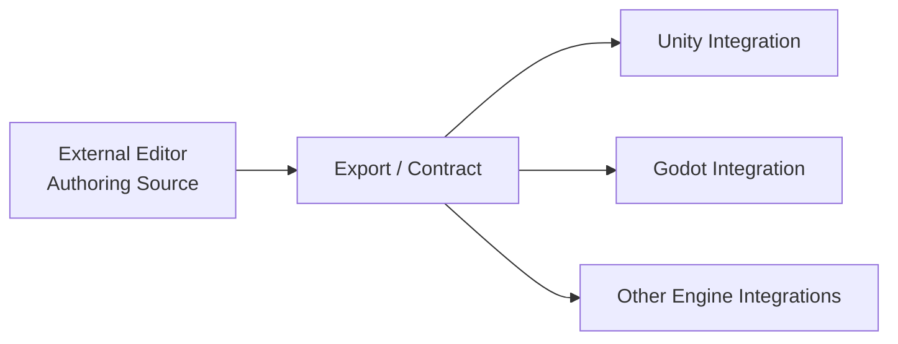

<div align="center">
  <h1>SceneBlueprint</h1>
  <p><strong>面向游戏开发的引擎无关外部场景蓝图编辑器</strong></p>
  <p>Authoring Source · External Editor · Runtime Contract · Engine Integration</p>
  <p>
    
    
    
    
    
    
  </p>
</div>

| 维度 | 说明 |
| --- | --- |
| 核心定位 | 以外部桌面编辑器为主入口，为 Unity、Godot 等引擎提供统一的场景蓝图制作体验、导出链路与运行时契约 |
| 项目来源 | 建立在 [`com.zgx197.sceneblueprint`](https://github.com/zgx197/com.zgx197.sceneblueprint) 与 [`com.zgx197.nodegraph`](https://github.com/zgx197/com.zgx197.nodegraph) 的实践基础上继续演进 |
| 设计取向 | 不再将引擎内嵌编辑器作为主工作流，而是采用“外部编辑器 + 引擎集成层”的职责拆分 |
| 目标对象 | TA、策划工具开发、项目级内容工具链、跨引擎运行时接入、复杂场景蓝图 Authoring 工作流 |

> 如果你第一次来到这个仓库，建议先看“快速导航”“项目背景”“为什么转向外部编辑器”三部分。

## 快速导航

- [这是什么](#这是什么)
- [项目背景](#项目背景)
- [为什么转向外部编辑器](#为什么转向外部编辑器)
- [当前架构定位](#当前架构定位)
- [技术栈与职责划分](#技术栈与职责划分)
- [公开入口](#公开入口)
- [发布与下载](#发布与下载)
- [本地运行](#本地运行)
- [仓库结构](#仓库结构)

## 这是什么

SceneBlueprint 是一个面向游戏开发的引擎无关外部场景蓝图编辑器。

它的目标不是替代某一个游戏引擎，而是把场景蓝图的制作流程从具体引擎宿主中抽离出来，形成一套更清晰的边界：

- 外部编辑器负责 Authoring、图形化编辑、校验、分析、调试与导出
- 引擎集成层负责资源同步、运行时接线、预览桥接与项目适配
- 运行时契约负责让不同引擎消费同一套蓝图导出结果

你可以把它理解为：从“Unity 内部工具窗口”演进为“跨引擎内容制作工具链”的 SceneBlueprint。

## 项目背景

当前项目并不是从零开始，而是建立在两个已有开源项目的实践基础上继续演进：

- [`com.zgx197.sceneblueprint`](https://github.com/zgx197/com.zgx197.sceneblueprint)
  早期面向 Unity 的场景蓝图框架，验证了场景蓝图 DSL、编辑器与运行时分层、导出契约、解释执行等核心方向。
- [`com.zgx197.nodegraph`](https://github.com/zgx197/com.zgx197.nodegraph)
  早期节点图底座，验证了节点图数据模型、编辑交互、GraphFrame 渲染描述、Unity 宿主适配等能力。

当前仓库可以视为这两条实践路线的进一步升级：

- 保留 SceneBlueprint 对场景蓝图分层、导出、运行时契约的核心判断
- 继承 NodeGraph 在图编辑与可视化工作台上的基础经验
- 在此基础上正式转向“外部编辑器优先”的新形态

## 为什么转向外部编辑器

随着场景蓝图设计越来越复杂，继续在 Unity 内部基于 IMGUI 低成本迭代主编辑器，已经在以下几个方面不可接受：

- 性能不可接受
  复杂节点图、面板联动、工作区恢复、分析与调试视图叠加后，IMGUI 方案难以稳定承载高性能交互体验。
- 功能完成度不可接受
  多窗口协作、复杂工作台布局、现代化桌面交互、更强的调试与可视化能力，在 Unity 内嵌 IMGUI 体系里实现成本过高。
- 长期演进成本不可接受
  当 Authoring 复杂度继续上升，编辑器 UI、引擎宿主限制与业务逻辑会越来越紧耦合，维护和扩展代价会持续放大。

因此，SceneBlueprint 选择把“蓝图制作工具”正式迁移到引擎无关的外部编辑器中实现。

这并不意味着放弃 Unity、Godot 等引擎生态，而是重新划分职责：

- 外部编辑器负责内容制作中心
- 引擎集成层负责引擎侧承接与项目接线
- 运行时与契约层继续保持可被不同引擎消费的清晰边界

## 当前架构定位

理解当前项目，最简单的方式就是把它看成三个正式部分：

| 部分 | 关注点 |
| --- | --- |
| Authoring Source | 蓝图定义、可视化编辑、校验、分析、导出前编排 |
| Runtime Contract | 导出边界、Schema、可被运行时稳定消费的契约 |
| Engine Integration | Unity、Godot 等引擎中的导入、同步、运行时接线、预览和适配 |

它们之间的关系可以概括为：



## 技术栈与职责划分

| 层 | 当前方向 |
| --- | --- |
| Authoring UI | `TypeScript + React`，负责工作台、编辑器交互与前端状态组织 |
| Desktop Host | `Rust + Tauri`，负责桌面宿主、窗口、系统集成与分发 |
| Toolchain / Runtime / Integration | `C#`，负责导出工具链、运行时契约承接、Unity/Godot 等引擎侧集成 |

这套选择的目标不是单语言统一，而是让不同层使用更适合自身职责的技术栈。

## 公开入口

- [项目主页（GitHub Pages）](https://zgx197.github.io/SceneBlueprint/)
- [GitHub Releases](https://github.com/zgx197/SceneBlueprint/releases)
- [对外文档索引](./docs/public/README.md)
- [开发文档索引](./docs/development/README.md)

## 发布与下载

- 正式版本会在推送 `v*` Git tag 后自动发布到 [GitHub Releases](https://github.com/zgx197/SceneBlueprint/releases)
- Windows 安装包、MSI 安装包、免安装绿色版会自动附加到对应 Release
- 对外发布说明可查看 [发布与下载文档](./docs/public/releases.md)

当前发布资产说明：

| 文件 | 用途 |
| --- | --- |
| `setup.exe` | 面向大多数 Windows 用户的标准安装版 |
| `*.msi` | 面向企业部署、静默安装和统一分发的 MSI 安装包 |
| `portable.zip` | 免安装绿色版，适合快速验证与内部测试 |

## 本地运行

1. 安装 Node.js、Rust、Visual Studio C++ Build Tools 与 WebView2 Runtime
2. 在仓库根目录执行 `npm install`
3. 执行 `npm run dev`

如果只需要验证前端工作台，可执行：

```bash
npm run dev:web
```

## 仓库结构

| 目录 | 作用 |
| --- | --- |
| `src/` | 前端工作台与 Authoring 壳层 |
| `src-tauri/` | Tauri / Rust 桌面宿主 |
| `schemas/` | Schema 与后续契约定义位置 |
| `examples/` | 样例工程与验证数据 |
| `toolchain/` | 后续 C# 工具链入口 |
| `integrations/` | 后续 Unity / Godot 等引擎集成 |
| `docs/public/` | 对外说明文档 |
| `docs/development/` | 内部设计、实现与迭代文档 |

## 阅读建议

| 你现在最关心什么 | 建议先看 |
| --- | --- |
| 我想知道这个仓库是做什么的 | “这是什么” 与 “当前架构定位” |
| 我想知道为什么不继续做 Unity 内嵌编辑器 | “项目背景” 与 “为什么转向外部编辑器” |
| 我想知道当前发布产物怎么获取 | “发布与下载” |
| 我想看更完整的对外说明 | [docs/public/README.md](./docs/public/README.md) |
| 我想看设计与实现边界 | [docs/development/README.md](./docs/development/README.md) |

## License

本项目使用 [Apache License 2.0](./LICENSE)。
