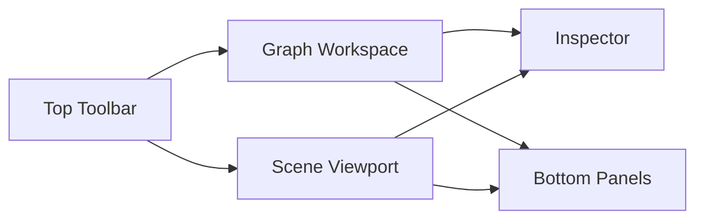
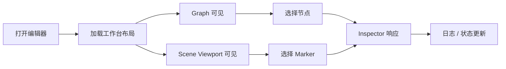

# SceneBlueprint 实现与迭代文档

> 版本：v0.4
> 日期：2026-03-29
> 状态：执行中，第一阶段桌面盒子已落地，第二阶段工作台 UI 设计已启动

---

## 状态标记说明

- 已完成：当前阶段已经落地并验证通过
- 进行中：已经启动实施，但仍会继续补充
- 部分已完成：已有落地结果，但还未完全收口
- 待开始：后续阶段规划，当前尚未进入实施
- 已确认：当前判断或边界已经确认
- 长期有效：作为长期规则保留，不表示某次迭代完成
- 已建立：约束或验证机制已经建立，可继续扩展
- 已落地：骨架或阶段成果已经形成

---

## 1. 文档定位（长期有效）

本文档用于描述 SceneBlueprint 当前阶段的实现策略、迭代顺序、验证方式和阶段性交付物。

本文档与《架构设计文档》分离：

- 架构设计文档：描述长期设计边界、架构原则、模块职责与稳定约束
- 实现与迭代文档：描述当前阶段先做什么、后做什么、如何逐轮搭建产品骨架

本文档不负责定义最终架构，而是负责指导当前阶段的落地顺序。

---

## 2. 当前阶段的核心判断（已确认）

当前阶段最重要的判断已经明确：

**第一阶段不是把 SceneBlueprint 做成“功能完整的编辑器”，而是先把 Tauri 这只盒子搭起来。**

这里所说的“盒子”，指的是：

- 桌面宿主形态先成立
- 工程结构先成立
- 前后端宿主通路先成立
- 后续可持续往里面填充 Authoring、Toolchain、Preview、Integration 等能力

因此，第一阶段优先目标不是功能丰富，而是**先建立一个正确的外部编辑器容器**。

---

## 3. 当前实施原则（进行中）

### 3.1 先搭盒子，再填内容

第一阶段优先建立宿主骨架，而不是优先追求复杂业务功能。

当前原则：

- 先让外部编辑器作为桌面应用真正跑起来
- 先建立 Tauri + 前端 + 宿主桥接的最小结构
- 先验证桌面应用形态、目录结构和通信边界
- 再逐步把 Authoring 能力、导出链和测试能力填进去

### 3.2 先确认主容器，再扩业务闭环

当前阶段不要求第一轮就打通全部编辑闭环。

当前更优先的是确认：

- Tauri 是否作为当前桌面宿主落地
- 前端工作台是否能稳定挂载在桌面壳中
- Rust 宿主是否能承担基础文件与进程桥职责
- 后续 C# Toolchain 是否能自然接入这只盒子

### 3.3 逐层填充，而不是一次性铺开

SceneBlueprint 后续能力很多，但当前应按层推进：

1. 先有盒子
2. 再有工作台界面
3. 再有最小 authoring 数据
4. 再有导出链
5. 再有测试与性能观测
6. 再有引擎集成与实时联动

### 3.4 验证宿主形态优先于验证高级交互

当前阶段比“节点能否拖得很顺”更重要的问题是：

- 宿主结构是否合理
- 前后端边界是否合理
- 本地文件能力是否易于扩展
- Toolchain 接入口是否自然
- 后续多引擎集成是否不会被宿主层拖累

### 3.5 文档随着阶段目标同步收敛

当前阶段的实现文档应明确服务于“盒子优先”的目标。

因此：

- 暂不把第一阶段写成完整编辑器 MVP
- 暂不把所有功能闭环都塞进第一阶段
- 暂不要求第一阶段完成太多业务层能力

---

## 4. 第一阶段目标（进行中）

### 4.1 第一阶段总目标（已确认）

第一阶段的总目标是：

**实现 Tauri 桌面宿主骨架，让 SceneBlueprint 先成为一个可持续填充内容的外部编辑器容器。**

### 4.2 第一阶段交付重点（进行中）

第一阶段建议聚焦以下交付物：

- Tauri 工程初始化完成
- 前端应用能在 Tauri 中稳定启动
- Rust 宿主工程结构建立完成
- 前后端基础通信链路可用
- 基础菜单、窗口或命令入口具备雏形
- 基础目录结构与模块边界开始落地
- 为后续接入文件系统、Toolchain、Authoring Core 留出位置

### 4.3 第一阶段不要求完成的内容（已确认）

第一阶段暂不要求完整实现：

- 完整节点图编辑器
- 完整 Inspector
- 完整 Timeline
- 完整导出链
- 完整运行时契约
- 完整白模预览
- 完整测试体系
- Unity / Godot 集成闭环

这些都属于后续往盒子里逐步填充的内容。

### 4.4 第一阶段当前完成情况（已完成）

截至 2026-03-28，第一阶段已经完成以下落地内容：

- Tauri 工程已经初始化并能启动桌面窗口
- 前端工作台骨架已经接入桌面宿主
- Rust 宿主目录已经按后续扩展方向拆出基础模块
- 基础图标、配置、最小事件发送链路已经可用
- 仓库级目录占位已经建立，后续可以按阶段继续填充

当前第一阶段还没有结束，但“盒子是否成立”这个核心问题已经得到正向验证。

---

## 5. 第一阶段建议的落地顺序（部分已完成）

### 5.1 第一步：建立 Tauri 宿主工程（已完成）

目标：

- 让仓库具备正式桌面应用工程结构
- 明确前端入口与 Rust 宿主入口
- 验证最小开发、构建、运行链路

此阶段重点不是业务功能，而是工程形态。

### 5.2 第二步：建立前端工作台骨架（已完成）

目标：

- 在 Tauri 中挂载前端应用
- 建立主工作台容器
- 预留 Graph / Inspector / Timeline / Log 等区域

这一阶段可以只有占位结构，不需要完整交互。

### 5.3 第三步：建立宿主能力抽象（进行中）

目标：

- 抽象文件选择、打开、保存、工作区路径等基础宿主能力
- 明确哪些能力由前端声明，哪些能力由 Rust 提供
- 为后续文件监听、索引和进程调度做准备

### 5.4 第四步：预留 Toolchain 接入口（部分已完成）

目标：

- 明确未来 C# Toolchain 的接入位置
- 明确“导出”“校验”“生成”的宿主调用入口
- 先保证接口位置存在，不要求第一阶段全部打通

### 5.5 第五步：建立最小验证与记录方式（已完成）

目标：

- 能验证桌面应用能启动
- 能验证前后端通信可用
- 能验证基础宿主能力可调用
- 能记录当前阶段遇到的宿主边界问题

---

## 6. 第二阶段及之后的填充顺序（进行中）

在 Tauri 盒子建立完成后，建议按以下顺序逐步填充内容。

### 6.1 第二阶段：填入 Authoring 工作台（已确认）

建议填入：

- 主工作区布局
- Graph 区域基础视觉与选择态
- Scene Viewport 区域骨架
- Inspector 区域基础交互
- Bottom Panels（日志 / 问题 / 调试）骨架

目标是形成“像编辑器”的工作台，而不是立即形成完整编辑器能力。

### 6.1.1 第二阶段的关键判断（已确认）

进入外部编辑器形态后，SceneBlueprint 的 UI 不能被理解为“只有节点图的桌面版”。

当前已经确认：

- Graph 不是唯一主视图
- Scene Viewport 必须作为正式工作区预留
- Marker / Spatial Binding 不是附属能力，而是 Authoring 主链路的一部分
- Inspector 必须同时响应 Graph 选择态与 Scene 选择态

也就是说，第二阶段的目标不是简单把当前 `Graph + Inspector + Log` 做得更漂亮，而是建立一个真正适合场景蓝图作者工作的工作台结构。

### 6.1.2 第二阶段推荐的工作台结构（已确认）

当前推荐的工作台结构应调整为：

- Top Toolbar
- Graph Workspace
- Scene Viewport
- Inspector
- Bottom Panels

其关系可以简化理解为：

这套结构表达的是：

- Graph 与 Scene 是双主视图，而不是主次关系
- Inspector 是右侧统一信息编辑与分析入口
- Bottom Panels 用于日志、问题、调试和后续时间线承接

### 6.1.3 为什么第二阶段必须预留 Scene Viewport（已确认）

旧 Unity 版本中的真实工作流并不是单纯在节点图里连线，而是长期依赖：

- 在场景中放置 Marker
- 在场景中查看 Marker 的空间关系
- 在图与场景之间切换选择对象
- 通过场景白模验证空间逻辑与流程意图

因此，外部编辑器如果没有 Scene Viewport，就会导致：

- Marker 体系无法自然落地
- Spatial Binding 无法形成作者心智
- 后续 Unity / Godot 集成只能退回被动导入思路
- Graph 编辑器会被迫承担本不该承担的空间语义表达压力

所以第二阶段即便不完整实现白模预览，也必须先把 Scene Viewport 作为正式区域纳入工作台。

### 6.1.4 第二阶段推荐的 UI 实现顺序（已确认）

建议按以下顺序推进，而不是同时把所有面板做深：

1. 重构工作台布局
- 让现有工作台从 `Graph / Inspector / Timeline / Log` 升级为更接近正式编辑器的区域结构
- 明确 `Graph Workspace`、`Scene Viewport`、`Inspector`、`Bottom Panels` 的位置和职责

2. 先做 Top Toolbar
- 建立新建、保存、撤销/重做、运行状态、自动保存提示等全局入口
- 先把“编辑器是活的”这件事做出来

3. 再做 Graph Workspace
- 先实现画布容器、网格、缩放、平移、节点占位卡片、选择态
- 当前不要求第一轮就做完整节点编辑器

4. 再做 Scene Viewport
- 先做白模场景占位、基础相机控制、Marker 占位显示
- 第一轮目标是让 Scene 视窗成为可交互工作区，而不是完整 3D 工具

5. 再做 Inspector
- 先支持空白态、选中图态、选中节点态、选中 Marker 态
- 让 Inspector 成为 Graph 与 Scene 的统一响应区

6. 最后接 Bottom Panels
- 先承接日志、问题列表、调试输出
- Timeline 可以暂时继续以占位方式存在，不必抢在前面做深

### 6.1.5 第二阶段第一轮应形成的最小 UI 流程（已确认）

第二阶段第一轮不追求完整编辑能力，但应尽快形成以下最小流程：

1. 打开编辑器
2. 看到正式工作台布局
3. 能在 Graph 区域看到画布与节点占位
4. 能在 Scene Viewport 中看到基础白模或占位场景
5. 选中 Graph 节点后，Inspector 有响应
6. 选中 Scene Marker 后，Inspector 有响应
7. 底部面板能显示日志、问题或状态变化

可简化为：

### 6.1.6 第二阶段第一轮不要求完成的内容（已确认）

当前轮次仍不要求完整实现：

- 完整 Node Graph 编辑体验
- 完整 Scene Gizmo 工具系统
- 完整 Marker 放置工具链
- 完整 3D 白模资源系统
- 完整 Timeline 编辑交互
- 完整导出 / 回放 / 调试闭环

当前目标是先把工作流容器搭起来，而不是一次性把所有编辑器交互做完。

### 6.2 第三阶段：填入最小 Authoring 数据闭环（待开始）

建议填入：

- 最小 descriptor / schema 输入
- 最小 `.blueprint.json`
- 新建 / 打开 / 保存
- 最小编辑状态

### 6.3 第四阶段：填入最小导出链（待开始）

建议填入：

- 导出命令入口
- 最小 runtime contract
- 最小 validate / export 逻辑

### 6.4 第五阶段：补测试与性能观测（待开始）

建议补入：

- 基础逻辑测试
- 基础桌面壳自测
- 基础性能样本记录

### 6.5 第六阶段：接入引擎集成与实时联动（待开始）

建议后置：

- Unity / Godot 文件驱动闭环
- 场景摘要桥接
- 会话桥
- 调试联动

---

## 7. 目录演进路线图（长期有效）

当前目录结构不应一次性定死，而应随着阶段推进逐步升级。

目录演进的原则是：

- 第一阶段优先保证盒子成立
- 第二阶段优先保证工作台可扩展
- 第三阶段开始抽离真正的 Authoring Core
- 随着 Toolchain、Contract、Integration 稳定，再把它们提升为独立层

### 7.1 第一阶段：Tauri 盒子骨架（已落地）

第一阶段目录以“宿主成立”为目标，建议采用轻量结构：

- `src/`：前端工作台骨架
- `src-tauri/`：Rust 宿主骨架
- `toolchain/`：仅保留占位
- `integrations/`：仅保留占位
- `schemas/`：仅保留占位
- `examples/`：仅保留占位

这一阶段的重点不是目录多细，而是把以下边界先分开：

- 前端 UI
- 宿主能力
- 未来 Toolchain 位置
- 未来引擎集成位置

### 7.2 第二阶段：工作台层升级（待开始）

当 Tauri 盒子已经稳定，且开始填入主工作台界面时，前端目录应维持“页面壳 + 功能面板”的组织方式：

- `app/`：应用入口、布局、providers
- `features/workbench/`：工作台页面
- `features/graph/`：Graph 面板
- `features/scene/`：Scene Viewport 面板
- `features/inspector/`：Inspector 面板
- `features/bottom-panels/`：日志 / 问题 / 调试等底部区域
- `host/`：前端侧宿主桥接
- `shared/`：通用组件与样式

这一阶段仍不要求把复杂编辑器逻辑抽成独立核心层，因为此时主要还是在验证工作台形态。

当前对第二阶段前端结构的补充约束：

- `Graph Workspace` 与 `Scene Viewport` 应视为并列工作区
- `Inspector` 不应只绑定 Graph，而应绑定统一选择态
- `Bottom Panels` 后续可继续拆出 `timeline/`、`problems/`、`log/`、`debug/`
- 若工作台布局逐渐复杂，可补入 `features/layout/` 或 `features/workspace/`

### 7.3 第三阶段：Authoring Core 抽离（待开始）

当以下能力开始稳定时：

- 节点图不再只是占位，而是有真实编辑逻辑
- Inspector 开始依赖 schema 或 descriptor
- Timeline 开始拥有独立编辑模型
- 命令系统、选择态、Undo/Redo 开始出现
- `.blueprint.json` 开始形成明确编辑态结构

前端目录应升级，抽出独立 `authoring/`：

- `authoring/graph/`
- `authoring/inspector/`
- `authoring/timeline/`
- `authoring/document/`
- `authoring/command/`
- `authoring/selection/`
- `authoring/validation/`
- `authoring/services/`

此时需要明确一条约束：

- `features/` 负责页面与组合
- `authoring/` 负责真正的编辑器核心逻辑

### 7.4 第四阶段：Contract 与 Toolchain 边界提升（待开始）

当以下内容开始稳定时：

- `.blueprint.json` schema
- runtime contract schema
- descriptor 生成产物
- validate / export 流程
- 样例与 golden tests

则应把以下内容逐步升级为更清晰的独立目录或模块：

- `schemas/`
- `examples/`
- `toolchain/`
- `contract/`（前端侧消费层，必要时建立）

这一阶段的目标是让：

- Authoring Source
- Runtime Contract
- Toolchain

真正形成可测试、可替换、可验证的稳定边界。

### 7.5 第五阶段：Rust 宿主层继续细化（待开始）

当 Rust 宿主开始承接更多本地能力时，`src-tauri/src/` 应从简单骨架继续细分：

- `commands/`
- `services/app/`
- `services/workspace/`
- `services/toolchain/`
- `services/session/`
- `services/fs/`
- `state/`
- `events/`
- `ipc/`
- `errors/`

这样可以避免后续把所有宿主逻辑都堆到 `commands/` 和 `lib.rs` 中。

### 7.6 第六阶段：引擎集成层独立成长（待开始）

当 Unity / Godot 集成真正启动后，`integrations/` 目录应从占位升级为明确分层：

- `integrations/unity/`
- `integrations/godot/`
- `integrations/shared/`（若存在跨引擎桥接约束）

原则上：

- Integration 只消费 contract
- Integration 不定义 authoring 模型
- Integration 不接管编辑器主工作流

### 7.7 目录演进的触发条件（长期有效）

目录不应按“觉得以后可能会用到”而提前复杂化，而应按以下触发条件升级：

- 某类逻辑已经在多个位置重复出现
- 某个边界已经形成稳定概念
- 某个目录开始同时承担多种职责
- 某种类型的文件数量明显增长
- 某条链路已经需要独立测试和维护

### 7.8 当前结论（已确认）

当前阶段不需要一次性搭出最终目录。

当前最合理的做法是：

- 第一阶段先保持轻量骨架
- 在实现过程中持续观察哪些边界已经稳定
- 一旦 Authoring / Contract / Toolchain / Integration 进入稳定阶段，再把目录升级成更明确的分层结构

也就是说：

**目录应当随着系统成熟逐步长出来，而不是在第一天凭想象一次性定死。**

---

## 8. 当前推荐的验证方式（进行中）

### 8.1 第一阶段的验证重点（已建立）

第一阶段重点验证：

- Tauri 工程是否能稳定运行
- 前端工作台是否能在桌面壳中挂载
- Rust 宿主与前端是否能正常通信
- 工程结构是否适合继续扩展
- 是否已经形成明确的模块放置位置

### 8.2 当前阶段不应过度追求的验证（已确认）

当前阶段不必优先追求：

- 节点拖拽体验是否已经成熟
- 时间轴交互是否已经顺滑
- 大图性能是否已经最优
- 导出结果是否已经达到最终结构

这些要建立在盒子已经稳定之后。

### 8.3 当前阶段建议保留的基础验证（已建立）

即便第一阶段以宿主为主，也建议保留以下最基础验证：

- 应用启动验证
- 前后端消息验证
- 命令入口验证
- 构建成功验证

### 8.4 第二阶段建议新增的验证（待开始）

当第二阶段开始填入 UI 工作台时，建议新增以下基础验证：

- 工作台布局可见性验证
- Graph / Scene / Inspector 三方联动验证
- 基础选择态切换验证
- Scene Viewport 初始加载验证
- 顶部命令栏基础交互验证

这些验证当前不要求重型自动化，但至少应具备手动自测脚本或轻量 UI 回归样例。

---

## 9. 当前阶段不优先的事项（已确认）

为了避免第一阶段目标漂移，当前不优先推进：

- 完整概念整理
- 完整 Graph 交互
- 完整 Timeline 编辑能力
- 完整 Toolchain 主链路
- 完整 Runtime Contract 结构
- 完整白模预览
- 复杂实时同步
- 多引擎联调

这些能力都重要，但不应挤占“先搭好盒子”的优先级。

---

## 10. 文档维护原则（长期有效）

本文档应持续记录当前阶段的真实实施重心。

当前维护原则：

- 先记录阶段目标
- 再记录当前优先顺序
- 再记录阶段性验证方式
- 不提前把后续阶段内容写成当前阶段硬目标

若后续第一阶段结束，本文档应及时更新为：

- 盒子已建立完成
- 当前开始向盒子中填充哪一层内容

---

## 11. Git 提交约束（已建立）

为减少提交风格漂移，当前仓库对提交约定采用“本地约束 + 远端校验”双层策略。

当前约定：

- Git 提交作者统一使用 `zgx197`
- commit message 使用中文描述
- 本地默认通过仓库级 Git 配置约束提交作者，仓库默认身份保持为 `zgx197`
- 本地 `commit-msg` hook 作为可选模板保留，不作为默认强制手段
- 远端通过 GitHub Actions 做第二层校验

说明：

- 当前环境下优先依赖仓库级 Git 配置和远端校验，避免本地 hook 因平台差异阻塞正常提交
- 远端校验用于降低绕过本地配置后直接推送的风险
- 若未来需要更严格约束，可继续叠加分支保护规则

---

## 12. 当前结论（已确认）

SceneBlueprint 当前阶段的实现策略已经调整为：

- 第一阶段先实现 Tauri 盒子
- 第一阶段桌面宿主骨架已经落地
- 下一步进入第二阶段工作台 UI 骨架搭建
- 第二阶段应优先建立 `Graph + Scene Viewport + Inspector + Bottom Panels` 的正式工作台
- 后续再逐步往里面填充 Authoring、Toolchain、Preview、Integration 等内容

这意味着当前阶段的判断标准已经从“盒子是否成立”逐步过渡为：

- 工作台结构是否合理
- Graph 与 Scene 是否形成双主视图心智
- Inspector 是否能承接统一选择态
- 后续 Marker / Spatial Binding / 白模预览是否容易接入

---

## 文档信息

- 版本：v0.4
- 创建日期：2026-03-28
- 更新策略：随当前阶段实施重点逐步修订

