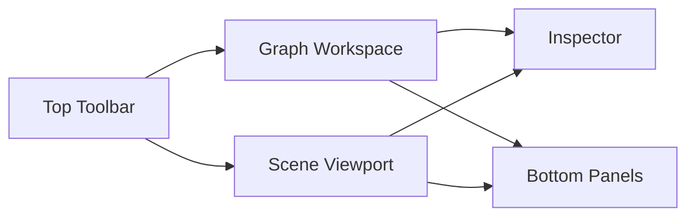
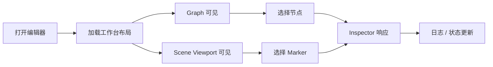
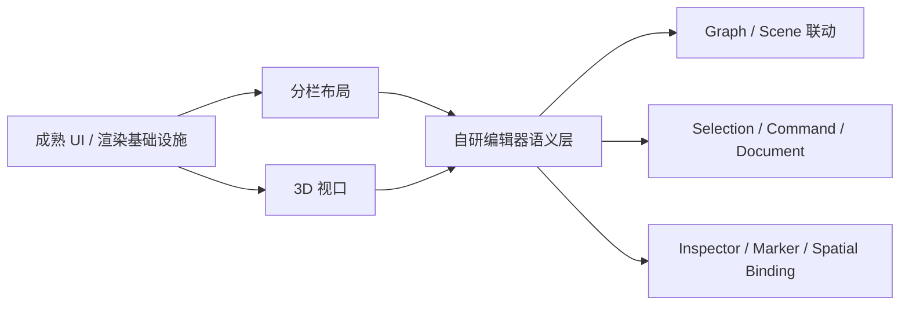

# SceneBlueprint 实现与迭代文档

> 版本：v0.6
> 日期：2026-03-29
> 状态：执行中，第一阶段桌面盒子已落地，第二阶段工作台第一轮骨架已落地

---

## 状态标记说明

- 已完成：当前阶段已经落地并验证通过
- 进行中：已经启动实施，但仍会继续补充
- 部分已完成：已有落地结果，但还未完全收口
- 待开始：后续阶段规划，当前尚未进入实施
- 已确认：当前判断或边界已经确认
- 长期有效：作为长期规则保留，不表示某次迭代完成
- 已建立：约束或验证机制已经建立，可继续扩展
- 已落地：骨架或阶段成果已经形成

---

## 1. 文档定位（长期有效）

本文档用于描述 SceneBlueprint 当前阶段的实现策略、迭代顺序、验证方式和阶段性交付物。

本文档与《架构设计文档》分离：

- 架构设计文档：描述长期设计边界、架构原则、模块职责与稳定约束
- 实现与迭代文档：描述当前阶段先做什么、后做什么、如何逐轮搭建产品骨架

本文档不负责定义最终架构，而是负责指导当前阶段的落地顺序。

---

## 2. 第一阶段总结（已确认）

第一阶段的核心目标不是把 SceneBlueprint 直接做成完整编辑器，而是先把 Tauri 桌面宿主这只“盒子”搭起来。

这里所说的“盒子”包括：

- 桌面宿主形态成立
- 前端工作台能够在桌面壳中稳定挂载
- Rust 宿主与前端基础通信链路可用
- 工程结构、目录边界和后续扩展位置先建立起来

因此，第一阶段关注的重点一直不是功能丰富度，而是：

- 宿主结构是否合理
- 前后端边界是否清晰
- 后续 Authoring、Toolchain、Preview、Integration 是否容易继续填充

截至当前，第一阶段已经完成并验证通过的内容包括：

- Tauri 工程初始化完成并可启动桌面窗口
- 前端工作台骨架已经接入桌面宿主
- Rust 宿主目录已经按后续扩展方向拆出基础模块
- 基础图标、配置、最小事件发送链路已经可用
- 仓库级目录占位已经建立，后续可以按阶段继续填充
- 基础开发、构建、发布链路已经打通

第一阶段明确不要求在当前轮次完成：

- 完整节点图编辑器
- 完整 Inspector / Timeline / 白模预览
- 完整导出链与运行时契约
- 完整测试体系
- Unity / Godot 集成闭环

这些能力会在后续阶段逐步填入，而不是继续塞回第一阶段。

---
## 6. 第二阶段及之后的填充顺序（进行中）

在 Tauri 盒子建立完成后，建议按以下顺序逐步填充内容。

### 6.1 第二阶段：填入 Authoring 工作台（进行中）

建议填入：

- 主工作区布局
- Graph 区域基础视觉与选择态
- Scene Viewport 区域骨架
- Inspector 区域基础交互
- Bottom Panels（日志 / 问题 / 调试）骨架

目标是形成“像编辑器”的工作台，而不是立即形成完整编辑器能力。
### 6.1.0 第二阶段当前状态总结（已建立）

截至当前代码库，第二阶段已经不再停留在纯设计讨论，而是进入“第一轮工作台骨架已落地”的状态。

当前已经落地的内容包括：

- 启动页已升级为正式启动界面，并接入真实启动链路
- 启动日志、桥接日志、宿主日志已经形成基础闭环
- 工作台已经稳定进入桌面窗口，不再停留在仅能显示网页容器的状态
- 主工作区已经形成 `Scene Viewport + Graph Workspace + Inspector + Status Bar` 的正式布局
- 分栏拖拽与尺寸记忆已经建立
- `Scene Viewport` 已接入第一版白模 3D 视口骨架
- 顶部区域已经从临时标题栏转向“原生菜单 + 工具栏信息带”的结构
- Tauri 原生菜单已经接入，并开始承接开发调试类命令

当前仍未完成的内容包括：

- Graph Workspace 仍主要是占位画布与说明区
- Inspector 仍主要呈现宿主与占位信息，尚未进入真实编辑态
- 底部区域目前以状态栏为主，尚未扩展为完整 Bottom Panels
- 文件、编辑、工具等大部分正式菜单命令仍未接入可用实现

因此，第二阶段当前应被理解为：

- 工作台骨架已经成立
- 真实编辑能力尚未展开
- 后续重点将从“把区域摆出来”转向“让区域真正开始工作”

### 6.1.1 第二阶段的关键判断（已确认）

进入外部编辑器形态后，SceneBlueprint 的 UI 不能被理解为“只有节点图的桌面版”。

当前已经确认：

- Graph 不是唯一主视图
- Scene Viewport 必须作为正式工作区预留
- Marker / Spatial Binding 不是附属能力，而是 Authoring 主链路的一部分
- Inspector 必须同时响应 Graph 选择态与 Scene 选择态

也就是说，第二阶段的目标不是简单把当前 `Graph + Inspector + Log` 做得更漂亮，而是建立一个真正适合场景蓝图作者工作的工作台结构。

### 6.1.2 第二阶段推荐的工作台结构（已确认）

当前推荐的工作台结构应调整为：

- Top Toolbar
- Graph Workspace
- Scene Viewport
- Inspector
- Bottom Panels

其关系可以简化理解为：

这套结构表达的是：

- Graph 与 Scene 是双主视图，而不是主次关系
- Inspector 是右侧统一信息编辑与分析入口
- Bottom Panels 用于日志、问题、调试和后续时间线承接

### 6.1.3 为什么第二阶段必须预留 Scene Viewport（已确认）

旧 Unity 版本中的真实工作流并不是单纯在节点图里连线，而是长期依赖：

- 在场景中放置 Marker
- 在场景中查看 Marker 的空间关系
- 在图与场景之间切换选择对象
- 通过场景白模验证空间逻辑与流程意图

因此，外部编辑器如果没有 Scene Viewport，就会导致：

- Marker 体系无法自然落地
- Spatial Binding 无法形成作者心智
- 后续 Unity / Godot 集成只能退回被动导入思路
- Graph 编辑器会被迫承担本不该承担的空间语义表达压力

所以第二阶段即便不完整实现白模预览，也必须先把 Scene Viewport 作为正式区域纳入工作台。

### 6.1.4 第二阶段推荐的 UI 实现顺序（已确认）

建议按以下顺序推进，而不是同时把所有面板做深：

1. 重构工作台布局
- 让现有工作台从 `Graph / Inspector / Timeline / Log` 升级为更接近正式编辑器的区域结构
- 明确 `Graph Workspace`、`Scene Viewport`、`Inspector`、`Bottom Panels` 的位置和职责

2. 先做 Top Toolbar
- 建立新建、保存、撤销/重做、运行状态、自动保存提示等全局入口
- 先把“编辑器是活的”这件事做出来

3. 再做 Graph Workspace
- 先实现画布容器、网格、缩放、平移、节点占位卡片、选择态
- 当前不要求第一轮就做完整节点编辑器

4. 再做 Scene Viewport
- 先做白模场景占位、基础相机控制、Marker 占位显示
- 第一轮目标是让 Scene 视窗成为可交互工作区，而不是完整 3D 工具

5. 再做 Inspector
- 先支持空白态、选中图态、选中节点态、选中 Marker 态
- 让 Inspector 成为 Graph 与 Scene 的统一响应区

6. 最后接 Bottom Panels
- 先承接日志、问题列表、调试输出
- Timeline 可以暂时继续以占位方式存在，不必抢在前面做深

### 6.1.5 第二阶段第一轮应形成的最小 UI 流程（已确认）

第二阶段第一轮不追求完整编辑能力，但应尽快形成以下最小流程：

1. 打开编辑器
2. 看到正式工作台布局
3. 能在 Graph 区域看到画布与节点占位
4. 能在 Scene Viewport 中看到基础白模或占位场景
5. 选中 Graph 节点后，Inspector 有响应
6. 选中 Scene Marker 后，Inspector 有响应
7. 底部面板能显示日志、问题或状态变化

可简化为：

### 6.1.6 第二阶段第一轮不要求完成的内容（已确认）

当前轮次仍不要求完整实现：

- 完整 Node Graph 编辑体验
- 完整 Scene Gizmo 工具系统
- 完整 Marker 放置工具链
- 完整 3D 白模资源系统
- 完整 Timeline 编辑交互
- 完整导出 / 回放 / 调试闭环

当前目标是先把工作流容器搭起来，而不是一次性把所有编辑器交互做完。

### 6.1.7 第二阶段 UI 技术选型建议（已确认）

当前阶段不建议把编辑器 UI 基础设施全部手写。

原因很明确：

- 我们当前最需要的是快速验证工作流和区域协作关系
- 手写分栏、拖拽、面板尺寸持久化、复杂交互细节，前期投入高且容易反复推翻
- SceneBlueprint 真正需要长期掌控的不是“通用 UI 组件能力”，而是 Graph / Scene / Inspector / Marker / Spatial Binding 这些编辑器语义

因此，当前推荐采用“成熟基础设施 + 自研编辑器语义层”的组合策略。

建议拆分为以下边界：

- 分栏布局与拖拽：优先使用成熟库
- 3D 视口渲染：优先使用成熟图形生态
- 编辑器状态、选择态、命令系统、文档模型、Inspector schema、Marker 语义：坚持自研
- 节点图基础画布：前期可以借鉴成熟方案，但不要过早把核心模型深度绑定到第三方库内部约束上

可以简化理解为：

### 6.1.8 当前推荐的库分工（已确认）

#### 1. 分栏布局与尺寸拖拽

推荐优先考虑：

- `react-resizable-panels`

理由：

- 它非常贴近我们当前最需要的能力：横向/纵向分栏、拖拽调整、默认尺寸、折叠扩展
- 比完全手写拖拽逻辑更稳定，后续维护成本更低
- 与当前 React 工作台骨架兼容度高，接入成本低
- 适合从“盒子”阶段快速升级到真正可用的编辑器工作台

当前不建议继续长期依赖纯手写分栏逻辑作为正式方案，因为：

- 拖拽边界、最小尺寸、嵌套布局、尺寸记忆都会持续增加复杂度
- 这类问题不是 SceneBlueprint 的核心竞争力

#### 2. Scene Viewport / 白模 3D 视口

推荐路线：

- `three.js`
- `@react-three/fiber`

理由：

- 我们需要的是可持续扩展的 3D 视口，而不是一次性演示用 canvas
- 后续 Marker、选中态、高亮、简单 gizmo、相机控制都可以逐步建立在这套生态上
- React 层与视口层协作会更自然，便于与 Inspector、Selection State 联动

当前不建议自己从零封装底层 3D 视口基础设施，因为：

- 初期会把大量时间消耗在渲染与交互细节上
- 很容易偏离“先验证工作流”的阶段目标

#### 3. Graph Workspace / 节点图区域

当前建议：

- 第一轮先把 Graph Workspace 作为“受控工作区”来搭建
- 画布、缩放、平移、节点占位、选择态、区域协同优先
- 不急于在第一轮深度接入重量级节点图框架

可观察或短期参考：

- `React Flow`

但当前判断是：

- 可以参考其交互思路
- 不应在还没稳定文档模型、节点语义、端口规则、命令系统之前，把核心 Authoring 模型深度绑定到第三方节点图内部机制上

换句话说：

- Graph 的“视觉交互基础设施”可以借力
- Graph 的“编辑器语义与数据模型”必须掌握在我们自己手里

### 6.1.9 第一轮最值得接入的库（已确认）

如果只看当前阶段的投入产出比，第一轮最划算的接入对象是：

- `react-resizable-panels`

原因不是它最“酷”，而是它最直接解决当前主痛点：

- 现在工作台已经进入 `Scene / Graph / Inspector / Status` 的正式布局阶段
- 用户会立刻感知到分栏拖拽、尺寸调整、布局稳定性是否成立
- 这部分能力会贯穿后续几乎所有阶段，不是一次性代码
- 接入后可以马上减少手写布局控制代码，让我们更快进入 Scene Viewport 和 Graph Workspace 本体建设

当前推荐的接入顺序是：

1. 先接入 `react-resizable-panels`，把工作台分栏稳定下来
2. 再接入 `three.js + @react-three/fiber`，把 Scene Viewport 白模骨架做出来
3. Graph Workspace 继续先用自研骨架推进，必要时再评估是否局部借助节点图库

当前不建议第一轮就先接入节点图库，原因是：

- 现在最需要验证的是整体工作台，不是节点细节
- 节点图库一旦接早了，容易把注意力带偏到节点编辑细节上
- 这会延后 Scene 与 Graph 双主视图工作流的建立

### 6.1.10 第二阶段第一轮已落地结果（已落地）

当前第一轮已经落地的实际结果，可以按“启动、布局、视口、菜单、诊断”五个方面来理解。

#### 1. 启动与诊断

已经落地：

- 启动页不再是简单占位，而是与真实初始化步骤挂钩
- 首步宿主初始化失败时，会停留在启动页，不会继续误入工作台
- 前端运行时异常监听、工作台错误边界、Scene Viewport 错误边界已经建立
- 日志已支持前端内存日志与宿主本地日志落盘
- Rust 日志时间已统一为 ISO 时间格式

这意味着当前已经具备“出问题时能够继续定位”的最小诊断能力。

#### 2. 工作台布局

已经落地：

- 正式工作台区域已经形成
- 左侧为 `Scene Viewport`
- 中部为 `Graph Workspace`
- 右侧为 `Inspector`
- 底部目前收敛为较薄的 `Status Bar`
- 分栏支持拖拽调整
- 分栏尺寸支持记忆
- 提供了“重置布局”入口

当前判断：

- 这套布局已经可以支撑后续继续填充复杂编辑能力
- 但底部仍只是状态栏，不应误判为完整 Bottom Panels 已经完成

#### 3. Scene Viewport

已经落地：

- 接入 `three.js + @react-three/fiber`
- 白模地面、基础块体、Marker 占位已经可见
- 具备基础轨道相机交互
- 已经能够承担“空间工作区占位”的角色

当前判断：

- Scene Viewport 已经从“概念预留”升级为“可交互骨架”
- 但还未进入选中、拾取、Marker 编辑、Gizmo、空间绑定等真实 Authoring 能力

#### 4. 顶部导航与菜单

已经落地：

- 顶部区域已经改为更接近正式工具的工具栏信息带
- Tauri 原生菜单已经接入
- 菜单结构已经形成 `文件 / 编辑 / 视图 / 工具 / 开发 / 帮助`
- `开发` 菜单已承接宿主通信验证与日志路径输出
- `视图 -> 重置布局` 已可用
- 尚未实现的菜单项已经显示为 `按钮 [不可用]`

当前判断：

- 原生菜单负责全局命令入口
- 顶部工具栏负责呈现当前项目、工作区、模式、宿主、通信状态
- 这套方向已经明确，不需要再退回临时标题栏方案

#### 5. 当前未完成但已明确的第二阶段后续重点（已确认）

接下来第二阶段不应继续平均铺开，而应按以下重点推进：

1. 让 Graph Workspace 从说明区升级为真正的可交互画布
2. 让 Inspector 从信息面板升级为响应选择态的真实编辑区
3. 把底部从状态栏升级为可扩展的 Bottom Panels 体系
4. 把菜单命令从“结构已建立”逐步升级为“真实可用”
5. 开始建立 Graph / Scene / Inspector 之间的统一选择态

### 6.1.11 Graph Workspace 第二轮的分层建议（已确认）

在继续推进 Graph Workspace 之前，我们已经重新回看了旧 Unity 版本的 `com.zgx197.nodegraph` 与 `com.zgx197.sceneblueprint`。

当前已经确认：

- 旧 `nodegraph` 不是单纯渲染层，而是完整的图编辑基础设施
- 旧 SceneBlueprint 更多是建立在其上的业务语义层、Inspector 层、Binding 层与编辑器工作流层
- 这条分层思路应继续保留到当前外部编辑器，而不是重新把所有逻辑揉进单一 Graph 组件

因此，第二阶段后续不应把 Graph Workspace 理解为“一个越来越复杂的 React 画布组件”，而应逐步拆出以下边界：

- Graph Document
- Graph Commands
- Graph View State
- Graph Definitions
- Graph UI Adapter
- Inspector Binding

它们各自的职责应理解为：

| 边界 | 当前职责 | 当前是否应尽快建立 |
|------|----------|-------------------|
| Graph Document | 节点、端口、边、分组、子图、注释等稳定编辑态数据 | 是 |
| Graph Commands | 增删节点、移动、连接、断开、撤销重做 | 是 |
| Graph View State | 选中、悬停、拖拽、视口、缩放、连接预览 | 是 |
| Graph Definitions | 节点类型、端口语义、分类、搜索元数据 | 是 |
| Graph UI Adapter | 把文档模型映射到具体节点图库或画布实现 | 是 |
| Inspector Binding | 选中对象到右侧属性区的绑定与投影 | 是 |

当前不建议把以下内容混在一起推进：

- 用 UI 组件内部状态直接替代 Graph 文档模型
- 用节点图库内部数据结构直接充当 SceneBlueprint 的核心 Authoring 模型
- 把场景绑定、宿主对象引用、Marker 引用直接写进 Graph 纯文档模型

### 6.1.12 Graph Workspace 第二轮的实现判断（已确认）

结合旧方案和当前外部编辑器形态，第二轮实现应坚持以下判断：

1. 详细编辑优先放到 Inspector
- 节点图上的节点卡片优先承担浏览、连接、结构调整职责
- 节点详细属性编辑优先通过右侧 Inspector 完成
- 不急于先做重型节点内联编辑

2. 第三方节点图库可以接入，但只能作为 UI 适配层
- 可以借助成熟交互能力来减少首轮手写成本
- 但 Graph Document / Commands / View State / Definitions 不能被其反向定义

3. Graph 与 Scene 必须继续按双主视图推进
- Graph Workspace 不应独占 Authoring 心智
- Marker、Spatial Binding、Scene 选择态必须继续预留与 Graph 的统一联动

4. Session 仍然是顶层编排中心
- Graph、Scene、Inspector、日志、分析、导出、最近项目等能力最终都应由 Session 或等价顶层上下文串起来

### 6.1.13 Graph Workspace 第二轮建议的最小落地顺序（已确认）

当前最合适的顺序不是直接追求“完整节点图体验”，而是先把基础分层落起来。

建议顺序如下：

1. 建立最小 `Graph Document`
- 节点、端口、边的最小结构先稳定
- 先不急于把子图、分组、注释一次做全

2. 建立最小 `Graph View State`
- 选中节点
- 当前视口
- 当前拖拽态
- 当前连线预览态

3. 建立最小 `Graph Commands`
- 添加节点
- 移动节点
- 连接端口
- 删除节点 / 断开边
- Undo / Redo 入口占位

4. 建立 `Graph Definitions`
- 节点类型目录
- 端口语义定义
- 分类与搜索元数据

5. 最后再接 `Graph UI Adapter`
- 让具体画布或节点图库只负责显示与交互
- 不负责定义 SceneBlueprint 内部模型

### 6.1.14 Graph Workspace 当前阶段不急于实现的内容（已确认）

第二阶段接下来的几轮里，以下内容不应抢在前面：

- 完整子图系统
- 完整分组与注释体系
- 复杂端口槽位与高级端口布局
- 节点内联表单编辑
- 自定义渲染管线
- 过早抽象出过重的平台编辑控件层

当前优先级仍然应是：

- 先让 Graph Workspace 成为真正可工作的结构编辑区
- 再让 Inspector 与 Scene 联动起来
- 再继续做复杂的节点图语义增强

### 6.1.15 Graph Canvas 交互规格已完成收敛（已完成）

在继续推进 Graph Workspace 实现之前，当前已经单独完成了一份正式的 `Graph Canvas` 交互设计清单：

- 文档位置：`docs/development/GraphCanvas-交互设计清单.md`

这份文档已经明确了当前仓库第一轮 Graph Canvas 的核心规则：

- 四类命中目标：`canvas / node / edge / port`
- 统一命中优先级：`port > edge > node > canvas`
- 左键、右键、中键、滚轮、Esc 的职责边界
- 右键前的选择态切换规则
- `Canvas / Node / Edge` 三类菜单的第一轮最小项
- 连线的开始、预览、完成、取消规则
- 节点删除与“断开所有连线”的语义区别
- 菜单动作与命令层之间的推荐映射关系

这意味着后续第二阶段继续推进右键菜单、断线命令、端口菜单、框选和多选时，已经不需要再回到“基础规则是否成立”的讨论，而应直接按这份交互规格继续实现。

当前判断：

- 第二阶段关于 `Graph Canvas` 的第 1 步已经严格意义上完成
- 后续实现重点应进入“抽离菜单模型、补齐命令层能力、收口上下文菜单行为”的阶段
### 6.1.16 Graph Canvas 命中与菜单模型已建立（已完成）

在第一轮交互规格已经收敛之后，当前仓库已经继续完成了 `Graph Canvas` 的第 2 步实现：

- 抽离命中目标模型
- 抽离上下文菜单模型
- 让 `GraphCanvas` 从“直接写死菜单判断”升级为“消费交互模型”的结构

当前已经建立的内容包括：

- `src/features/graph/ui/graphCanvasContextMenuModel.ts`
- `src/features/graph/ui/GraphCanvasContextMenu.tsx`
- `src/features/graph/ui/GraphCanvas.tsx` 已改为消费上述模型

当前已经稳定下来的边界包括：

- `GraphHitTargetDescriptor`：用于描述右键或命中事件的原始目标
- `GraphHitTarget`：用于描述带世界坐标的正式命中目标
- `GraphContextMenuState`：统一承接当前菜单状态
- `GraphContextMenuModel`：统一承接当前菜单应显示的动作、分类和可创建节点项
- `getSelectionForGraphHitTarget(...)`：统一节点、边、端口右键前的选择态同步规则
- `buildGraphContextMenuModel(...)`：统一不同目标类型对应的菜单动作组织方式

这一步完成后，当前 Graph Canvas 已经不再依赖以下旧方式：

- 在组件 JSX 中直接按 `target === "node"` 或 `target === "edge"` 拼装菜单
- 在多个事件处理器中重复拼写节点、边、画布的右键选择逻辑
- 把“菜单状态”和“命中目标语义”混成一个临时对象

当前判断：

- 第二阶段关于 `Graph Canvas` 的第 2 步已经严格意义上完成
- 后续第 3 步可以直接在这套模型上继续补“菜单动作分发”和更完整的命令层能力，而不需要再次重构基础结构
### 6.1.17 Graph Canvas 第一版右键菜单已可用（已完成）

在命中目标模型与菜单模型已经建立之后，当前仓库已经继续完成了 `Graph Canvas` 的第 3 步实现：

- `Canvas / Node / Edge` 三类菜单已经按目标分开
- 第一轮菜单项已经与交互规格文档中的最小要求对齐
- 菜单动作已经从“临时 UI 逻辑”升级为“可执行的真实行为”

当前已经落地的菜单行为包括：

- `Canvas` 菜单：保留创建节点入口与 `重置视口`
- `Node` 菜单：`断开所有连线`、`删除当前节点`
- `Edge` 菜单：`删除当前连线`
- `Node / Edge` 菜单不再继续混入画布级节点创建浏览区

为支撑这一步，当前还同步补齐了第一条上下文菜单专属命令语义：

- `graph.disconnect-node-edges`

当前这条链路已经形成闭环：

- 菜单目标命中
- 右键前选择态同步
- 菜单模型构建
- 菜单动作分发
- 命令进入 reducer
- Graph 文档边关系真实更新

这意味着第 3 步现在已经不是“菜单看起来像是可用”，而是严格意义上的可执行功能。

当前判断：

- 第二阶段关于 `Graph Canvas` 的第 3 步已经严格意义上完成
- 后续第 4 步可以继续补更完整的命令层能力，例如端口级断线与更细粒度的上下文动作
### 6.1.18 Graph Canvas 命令层第一轮已补齐（已完成）

在第一版右键菜单已经可用之后，当前仓库已经继续完成了 `Graph Canvas` 的第 4 步实现：

- 将命令层从“节点级断线已具备”继续补齐到“端口级断线也具备”
- 把新命令贯通到 `command types -> reducer -> controller -> Graph Canvas 入口`
- 让端口级断线不再只是理论接口，而是能在画布上被真实触发和验证

当前已经补齐的能力包括：

- `graph.disconnect-node-edges`
- `graph.disconnect-port-edges`
- `GraphWorkspaceController.disconnectNodeEdges(...)`
- `GraphWorkspaceController.disconnectPortEdges(...)`

当前对应的可验证入口包括：

- 节点右键菜单中的 `断开所有连线`
- 端口右键菜单中的 `断开此端点所有连线`

这意味着第 4 步当前已经形成完整闭环：

- 命令类型已定义
- reducer 已处理
- controller 已提供稳定调用入口
- Graph Canvas 已提供真实触发入口
- 构建与类型检查已验证通过

当前判断：

- 第二阶段关于 `Graph Canvas` 的第 4 步已经严格意义上完成
- 后续如果继续推进，可进入更细粒度命令，例如仅断开输入、仅断开输出、边中插入节点等增强能力
### 6.2 第三阶段：填入最小 Authoring 数据闭环（待开始）

建议填入：

- 最小 descriptor / schema 输入
- 最小 `.blueprint.json`
- 新建 / 打开 / 保存
- 最小编辑状态

### 6.3 第四阶段：填入最小导出链（待开始）

建议填入：

- 导出命令入口
- 最小 runtime contract
- 最小 validate / export 逻辑

### 6.4 第五阶段：补测试与性能观测（待开始）

建议补入：

- 基础逻辑测试
- 基础桌面壳自测
- 基础性能样本记录

### 6.5 第六阶段：接入引擎集成与实时联动（待开始）

建议后置：

- Unity / Godot 文件驱动闭环
- 场景摘要桥接
- 会话桥
- 调试联动

---

## 7. 目录演进路线图（长期有效）

当前目录结构不应一次性定死，而应随着阶段推进逐步升级。

目录演进的原则是：

- 第一阶段优先保证盒子成立
- 第二阶段优先保证工作台可扩展
- 第三阶段开始抽离真正的 Authoring Core
- 随着 Toolchain、Contract、Integration 稳定，再把它们提升为独立层

### 7.1 第一阶段：Tauri 盒子骨架（已落地）

第一阶段目录以“宿主成立”为目标，建议采用轻量结构：

- `src/`：前端工作台骨架
- `src-tauri/`：Rust 宿主骨架
- `toolchain/`：仅保留占位
- `integrations/`：仅保留占位
- `schemas/`：仅保留占位
- `examples/`：仅保留占位

这一阶段的重点不是目录多细，而是把以下边界先分开：

- 前端 UI
- 宿主能力
- 未来 Toolchain 位置
- 未来引擎集成位置

### 7.2 第二阶段：工作台层升级（部分已完成）

当 Tauri 盒子已经稳定，且开始填入主工作台界面时，前端目录应维持“页面壳 + 功能面板”的组织方式：

- `app/`：应用入口、布局、providers
- `features/workbench/`：工作台页面
- `features/graph/`：Graph 面板
- `features/scene/`：Scene Viewport 面板
- `features/inspector/`：Inspector 面板
- `features/bottom-panels/`：日志 / 问题 / 调试等底部区域
- `host/`：前端侧宿主桥接
- `shared/`：通用组件与样式

这一阶段仍不要求把复杂编辑器逻辑抽成独立核心层，因为此时主要还是在验证工作台形态。
当前已经落地的目录结果包括：

- `features/workbench/` 已承接工作台页面
- `features/scene/` 已承接 Scene Viewport 及其白模视口骨架
- `features/inspector/` 已承接 Inspector 占位面板
- `features/status-bar/` 已承接底部状态栏
- `app/layout/` 已承接工作台整体布局
- `app/commands/` 已开始承接菜单命令定义与桥接
- `host/` 已继续承接前端侧宿主调用
- `shared/logging/`、`shared/theme/`、`shared/components/` 已形成基础共享层

因此，第二阶段目录层面已经不是“待开始”，而是已经进入可继续扩展的状态。

当前对第二阶段前端结构的补充约束：

- `Graph Workspace` 与 `Scene Viewport` 应视为并列工作区
- `Inspector` 不应只绑定 Graph，而应绑定统一选择态
- `Bottom Panels` 后续可继续拆出 `timeline/`、`problems/`、`log/`、`debug/`
- 若工作台布局逐渐复杂，可补入 `features/layout/` 或 `features/workspace/`

### 7.3 第三阶段：Authoring Core 抽离（待开始）

当以下能力开始稳定时：

- 节点图不再只是占位，而是有真实编辑逻辑
- Inspector 开始依赖 schema 或 descriptor
- Timeline 开始拥有独立编辑模型
- 命令系统、选择态、Undo/Redo 开始出现
- `.blueprint.json` 开始形成明确编辑态结构

前端目录应升级，抽出独立 uthoring/：

- uthoring/graph/
- uthoring/inspector/
- uthoring/timeline/
- uthoring/document/
- uthoring/command/
- uthoring/selection/
- uthoring/validation/
- uthoring/services/

同时，Graph Workspace 相关目录建议优先演进为：

- src/features/graph/document/
- src/features/graph/commands/
- src/features/graph/state/
- src/features/graph/definitions/
- src/features/graph/ui/
- src/features/graph/binding/

此时需要明确一条约束：

- eatures/ 负责页面与组合
- uthoring/ 负责真正的编辑器核心逻辑
- 文档模型不跟具体节点图库绑死
- 交互状态不跟持久化数据混在一起
- Inspector 绑定不直接侵入 Graph 文档

### 7.4 第四阶段：Contract 与 Toolchain 边界提升（待开始）

当以下内容开始稳定时：

- `.blueprint.json` schema
- runtime contract schema
- descriptor 生成产物
- validate / export 流程
- 样例与 golden tests

则应把以下内容逐步升级为更清晰的独立目录或模块：

- `schemas/`
- `examples/`
- `toolchain/`
- `contract/`（前端侧消费层，必要时建立）

这一阶段的目标是让：

- Authoring Source
- Runtime Contract
- Toolchain

真正形成可测试、可替换、可验证的稳定边界。

### 7.5 第五阶段：Rust 宿主层继续细化（待开始）

当 Rust 宿主开始承接更多本地能力时，`src-tauri/src/` 应从简单骨架继续细分：

- `commands/`
- `services/app/`
- `services/workspace/`
- `services/toolchain/`
- `services/session/`
- `services/fs/`
- `state/`
- `events/`
- `ipc/`
- `errors/`

这样可以避免后续把所有宿主逻辑都堆到 `commands/` 和 `lib.rs` 中。

### 7.6 第六阶段：引擎集成层独立成长（待开始）

当 Unity / Godot 集成真正启动后，`integrations/` 目录应从占位升级为明确分层：

- `integrations/unity/`
- `integrations/godot/`
- `integrations/shared/`（若存在跨引擎桥接约束）

原则上：

- Integration 只消费 contract
- Integration 不定义 authoring 模型
- Integration 不接管编辑器主工作流

### 7.7 目录演进的触发条件（长期有效）

目录不应按“觉得以后可能会用到”而提前复杂化，而应按以下触发条件升级：

- 某类逻辑已经在多个位置重复出现
- 某个边界已经形成稳定概念
- 某个目录开始同时承担多种职责
- 某种类型的文件数量明显增长
- 某条链路已经需要独立测试和维护

### 7.8 当前结论（已确认）

当前阶段不需要一次性搭出最终目录。

当前最合理的做法是：

- 第一阶段先保持轻量骨架
- 在实现过程中持续观察哪些边界已经稳定
- 一旦 Authoring / Contract / Toolchain / Integration 进入稳定阶段，再把目录升级成更明确的分层结构

也就是说：

**目录应当随着系统成熟逐步长出来，而不是在第一天凭想象一次性定死。**

---

## 8. 当前推荐的验证方式（进行中）

### 8.1 第一阶段的验证重点（已建立）

第一阶段重点验证：

- Tauri 工程是否能稳定运行
- 前端工作台是否能在桌面壳中挂载
- Rust 宿主与前端是否能正常通信
- 工程结构是否适合继续扩展
- 是否已经形成明确的模块放置位置

### 8.2 当前阶段不应过度追求的验证（已确认）

当前阶段不必优先追求：

- 节点拖拽体验是否已经成熟
- 时间轴交互是否已经顺滑
- 大图性能是否已经最优
- 导出结果是否已经达到最终结构

这些要建立在盒子已经稳定之后。

### 8.3 当前阶段建议保留的基础验证（已建立）

即便第一阶段以宿主为主，也建议保留以下最基础验证：

- 应用启动验证
- 前后端消息验证
- 命令入口验证
- 构建成功验证

### 8.4 第二阶段建议新增的验证（部分已完成）

当第二阶段开始填入 UI 工作台时，建议新增以下基础验证：

- 工作台布局可见性验证
- Graph / Scene / Inspector 三方联动验证
- 基础选择态切换验证
- Scene Viewport 初始加载验证
- 顶部命令栏基础交互验证

当前已经部分建立的内容包括：

- 工作台启动与挂载验证
- Scene Viewport 初始加载验证
- 顶部菜单命令入口验证
- 布局缓存与重置布局验证
- 运行时异常与日志回看能力

当前仍待补充的内容包括：

- Graph / Scene / Inspector 三方联动验证
- 基础选择态切换验证
- 更明确的手动自测脚本
- 轻量 UI 回归样例

这些验证当前不要求重型自动化，但至少应逐步形成稳定的手动验证路径。

---

## 9. 当前阶段不优先的事项（已确认）

为了避免第一阶段目标漂移，当前不优先推进：

- 完整概念整理
- 完整 Graph 交互
- 完整 Timeline 编辑能力
- 完整 Toolchain 主链路
- 完整 Runtime Contract 结构
- 完整白模预览
- 复杂实时同步
- 多引擎联调

这些能力都重要，但不应挤占“先搭好盒子”的优先级。

---

## 10. 文档维护原则（长期有效）

本文档应持续记录当前阶段的真实实施重心。

当前维护原则：

- 先记录阶段目标
- 再记录当前优先顺序
- 再记录阶段性验证方式
- 不提前把后续阶段内容写成当前阶段硬目标

若后续第一阶段结束，本文档应及时更新为：

- 盒子已建立完成
- 当前开始向盒子中填充哪一层内容

---

## 11. Git 提交约束（已建立）

为减少提交风格漂移，当前仓库对提交约定采用“本地约束 + 远端校验”双层策略。

当前约定：

- Git 提交作者统一使用 `zgx197`
- commit message 使用中文描述
- 本地默认通过仓库级 Git 配置约束提交作者，仓库默认身份保持为 `zgx197`
- 本地 `commit-msg` hook 作为可选模板保留，不作为默认强制手段
- 远端通过 GitHub Actions 做第二层校验

说明：

- 当前环境下优先依赖仓库级 Git 配置和远端校验，避免本地 hook 因平台差异阻塞正常提交
- 远端校验用于降低绕过本地配置后直接推送的风险
- 若未来需要更严格约束，可继续叠加分支保护规则

---

## 12. 当前结论（已确认）

SceneBlueprint 当前阶段的实现策略已经调整为：

- 第一阶段先实现 Tauri 盒子
- 第一阶段桌面宿主骨架已经落地
- 第二阶段工作台第一轮骨架已经落地
- 第二阶段应优先建立 `Graph + Scene Viewport + Inspector + Bottom Panels` 的正式工作台
- 后续再逐步往里面填充 Authoring、Toolchain、Preview、Integration 等内容

这意味着当前阶段的判断标准已经从“盒子是否成立”逐步过渡为：

- 工作台结构是否合理
- Graph 与 Scene 是否形成双主视图心智
- Inspector 是否能承接统一选择态
- 后续 Marker / Spatial Binding / 白模预览是否容易接入

---

## 文档信息

- 版本：v0.6
- 创建日期：2026-03-28
- 更新策略：随当前阶段实施重点逐步修订

