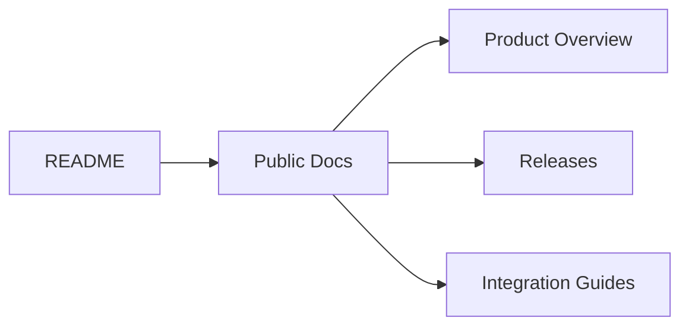

# 对外文档

  <h1>SceneBlueprint Public Docs</h1>
  
<strong>面向仓库访客、使用者与潜在集成方的公开说明入口</strong>

  
Overview · Download · Public Docs · Integration Entry

| 维度 | 说明 |
| --- | --- |
| 目录定位 | 存放面向仓库访客、使用者、潜在贡献者和集成方的公开说明文档 |
| 内容边界 | 只承载对外信息，不放内部实现阶段状态与研发迭代细节 |
| 主要用途 | 提供产品概览、下载入口、公开文档导航与后续集成说明 |

## 建议入口

如果你是第一次接触这个项目，建议从以下入口开始：

| 入口 | 用途 |
| --- | --- |
| [项目主页（GitHub Pages）](https://zgx197.github.io/SceneBlueprint/) | 对外首页与公开文档主入口 |
| [仓库首页 README](../../README.md) | 仓库首页概览 |
| [发布与下载](./releases.md) | 下载说明与交付说明 |
| [GitHub Releases](https://github.com/zgx197/SceneBlueprint/releases) | 稳定版、预发布版与安装包下载 |

## 当前公开文档方向

本目录后续会逐步补充：

- 产品概览
- 使用指南
- 集成说明
- 发布说明
- 常见问题

## 对外与内部文档边界

- `docs/public/` 面向外部读者，强调可理解、可下载、可接入
- `docs/development/` 面向仓库内部设计与实现推进，保留架构边界、实现计划与工程细节

如果你需要了解当前项目更完整的设计背景，可继续查看：

- [项目主页（GitHub Pages）](https://zgx197.github.io/SceneBlueprint/)
- [仓库首页 README](../../README.md)
- [开发文档索引](../development/README.md)
