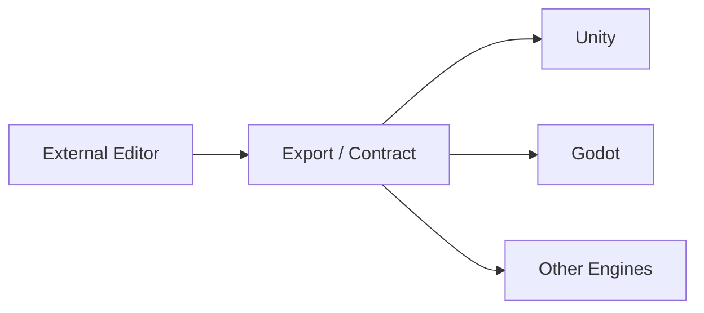

<div align="center">
  <h1>SceneBlueprint</h1>
  <p><strong>面向游戏开发的引擎无关外部场景蓝图编辑器</strong></p>
  <p>Authoring Source · External Editor · Runtime Contract · Engine Integration</p>
</div>

| 维度 | 说明 |
| --- | --- |
| 核心定位 | 以外部桌面编辑器为主入口，为 Unity、Godot 等引擎提供统一的场景蓝图制作体验、导出链路与运行时契约 |
| 项目来源 | 建立在 `com.zgx197.sceneblueprint` 与 `com.zgx197.nodegraph` 的实践基础上继续演进 |
| 设计取向 | 不再将引擎内嵌编辑器作为主工作流，而是采用“外部编辑器 + 引擎集成层”的职责拆分 |
| 公开范围 | 当前公开站点聚焦产品概览、下载入口、快速开始与后续公开文档导航 |

> 如果你第一次来到 SceneBlueprint，建议先看“这是什么”“为什么转向外部编辑器”“快速开始”三部分。

## 快速导航

- [这是什么](#这是什么)
- [项目背景](#项目背景)
- [为什么转向外部编辑器](#为什么转向外部编辑器)
- [当前架构定位](#当前架构定位)
- [快速开始](#快速开始)
- [文档入口](#文档入口)
- [下载发布版本](#下载发布版本)

## 这是什么

SceneBlueprint 是一个面向游戏开发的引擎无关外部场景蓝图编辑器。

它的目标不是替代某一个游戏引擎，而是把场景蓝图制作流程从具体引擎宿主中抽离出来，形成一套更稳定的内容制作边界：

- 外部编辑器负责 Authoring、图形化编辑、校验、分析、调试与导出
- 引擎集成层负责资源同步、运行时接线、预览桥接与项目适配
- 运行时契约负责让不同引擎消费同一套蓝图导出结果

## 项目背景

当前项目并不是从零开始，而是建立在两个已有开源项目的实践基础上继续演进：

- [`com.zgx197.sceneblueprint`](https://github.com/zgx197/com.zgx197.sceneblueprint)
  早期面向 Unity 的场景蓝图框架，验证了 DSL、编辑器与运行时分层、导出契约、解释执行等方向。
- [`com.zgx197.nodegraph`](https://github.com/zgx197/com.zgx197.nodegraph)
  早期节点图底座，验证了节点图数据模型、编辑交互、GraphFrame 渲染描述、Unity 宿主适配等能力。

当前仓库可以理解为：在前两条实践路线验证基础方向之后，针对更复杂的场景蓝图 Authoring 需求，进一步升级出来的新一代外部编辑器形态。

## 为什么转向外部编辑器

随着场景蓝图设计越来越复杂，继续在 Unity 内部基于 IMGUI 低成本迭代主编辑器，已经在以下几个方面不可接受：

- 性能不可接受
  复杂节点图、面板联动、工作区恢复、分析与调试视图叠加后，IMGUI 方案难以稳定承载高性能交互体验。
- 功能完成度不可接受
  多窗口协作、复杂工作台布局、现代化桌面交互、更强的调试与可视化能力，在 Unity 内嵌 IMGUI 体系里实现成本过高。
- 长期演进成本不可接受
  当 Authoring 复杂度继续上升，编辑器 UI、引擎宿主限制与业务逻辑会越来越紧耦合，维护和扩展代价会持续放大。

因此，SceneBlueprint 选择把蓝图制作工具正式迁移到引擎无关的外部编辑器中实现。

## 当前架构定位

理解当前项目，最简单的方式就是把它看成三个正式部分：

| 部分 | 关注点 |
| --- | --- |
| Authoring Source | 蓝图定义、可视化编辑、校验、分析、导出前编排 |
| Runtime Contract | 导出边界、Schema、可被运行时稳定消费的契约 |
| Engine Integration | Unity、Godot 等引擎中的导入、同步、运行时接线、预览和适配 |



## 快速开始

1. 安装 Node.js、Rust、Visual Studio C++ Build Tools 与 WebView2 Runtime
2. 克隆仓库并执行 `npm install`
3. 在仓库根目录执行 `npm run dev`

如果只需要验证前端工作台，可执行：

```bash
npm run dev:web
```

## 文档入口

| 入口 | 用途 |
| --- | --- |
| [项目主页（当前页面）](https://zgx197.github.io/SceneBlueprint/) | 对外主页与后续公开文档入口 |
| [仓库首页 README](https://github.com/zgx197/SceneBlueprint) | 仓库首页概览 |
| [对外文档目录](https://github.com/zgx197/SceneBlueprint/tree/master/docs/public) | 对外文档源文件目录 |
| [发布与下载说明](./releases.md) | 公开下载说明与交付说明 |
| [GitHub Releases](https://github.com/zgx197/SceneBlueprint/releases) | 稳定版、预发布版与安装包下载 |

## 下载发布版本

- 稳定版与预发布版本统一从 [GitHub Releases](https://github.com/zgx197/SceneBlueprint/releases) 获取
- 当前公开交付以 Windows 安装包、MSI 安装包与免安装绿色版为主
- 发布说明可查看 [发布与下载文档](./releases.md)

当前发布资产说明：

| 文件 | 用途 |
| --- | --- |
| `setup.exe` | 面向大多数 Windows 用户的标准安装版 |
| `*.msi` | 面向企业部署、静默安装和统一分发的 MSI 安装包 |
| `portable.zip` | 免安装绿色版，适合快速验证与内部测试 |

## 当前公开信息范围

本 Pages 站点当前用于承载：

- 产品概览
- 快速开始
- 下载入口
- 对外文档导航
- 后续公开使用文档与集成说明

内部设计、实现状态与阶段记录继续保留在仓库开发文档中，而不作为公开主页内容。
